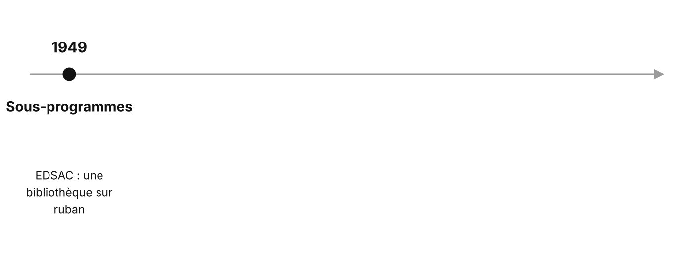
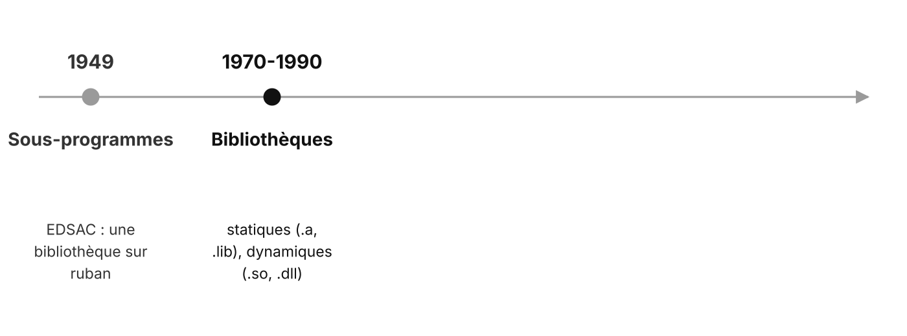
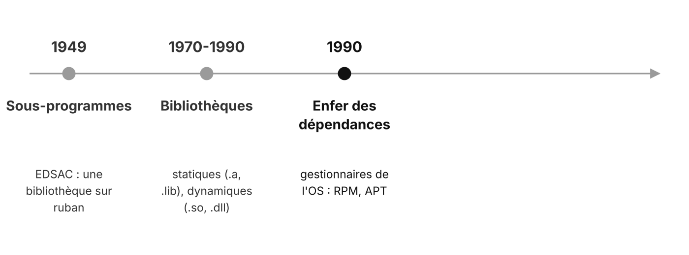
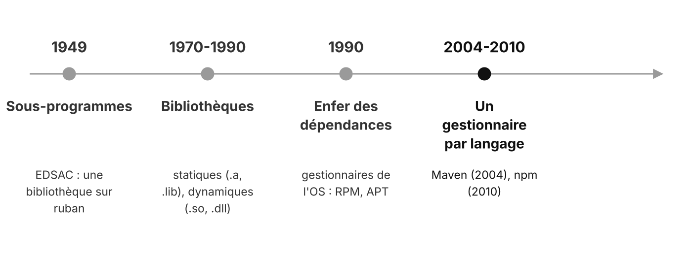
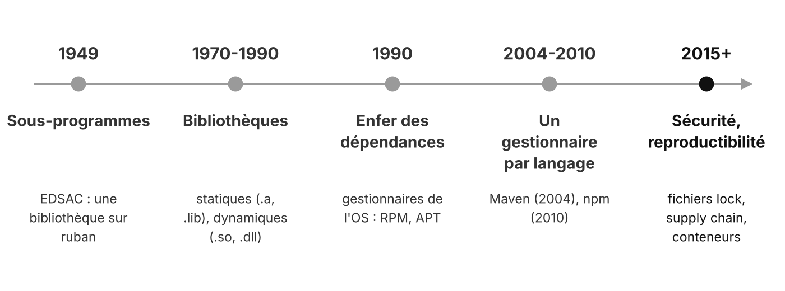
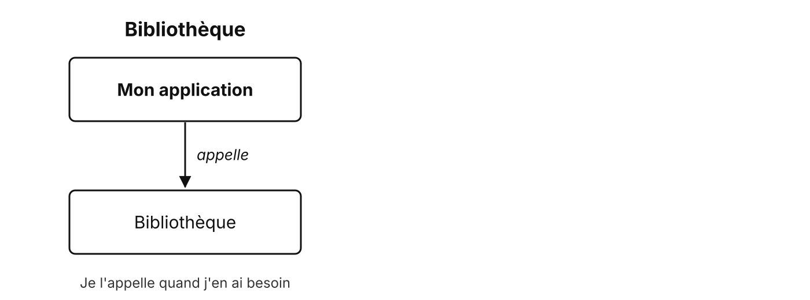
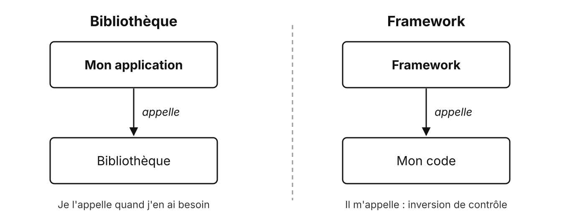
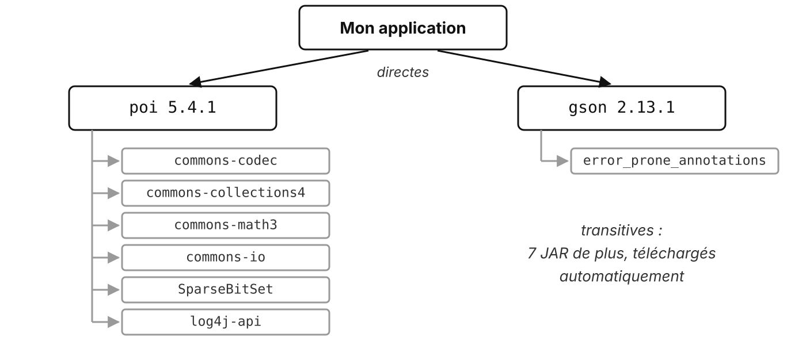

# Des fonctions réutilisables aux bibliothèques

Ne pas réinventer la roue

---

## Petit historique

<v-switch>
  <template #0></template>
  <template #1></template>
  <template #2></template>
  <template #3></template>
  <template #4></template>
</v-switch>

<!--
Une époque par clic.
- 1949 : EDSAC (Cambridge), Wheeler invente l'appel de sous-programme ; bibliothèque de sous-programmes sur ruban perforé (Wilkes, Wheeler, Gill, 1951).
- Statique : copié dans l'exécutable. Dynamique : chargé à l'exécution, partagé entre applications.
- 1990 : A a besoin de la v1 d'une DLL, B installe la v2 par-dessus, A plante.
- Depuis 2015 : fichiers lock (versions exactes de tout l'arbre), attaques par les dépendances (Log4j, xz-utils), Docker.
-->

---

## EDSAC, 1949


<p class="credit">EDSAC I, Computer Laboratory, University of Cambridge, CC BY 2.0</p>

<!-- Une des premières machines à programme enregistré. Sa bibliothèque de sous-programmes (calculs mathématiques, entrées-sorties) est l'ancêtre de nos bibliothèques. -->

---

## Une bibliothèque

**Du code réutilisable, écrit par d'autres, que mon application appelle**

- Des classes et des méthodes prêtes à l'emploi
- Pour un besoin précis : PDF, e-mail, JSON…
- Distribuée en Java sous forme de **JAR**

---

## Pourquoi l'utiliser ?

- **Gagner du temps** : ne pas réimplémenter un format ou un protocole
- **Fiabilité** : code testé et corrigé par des milliers d'utilisateurs
- **Se concentrer sur le métier** : la facture, pas la norme PDF

<!-- Rappel de la séquence précédente : spécification PDF, SMTP, MIME, RFC. -->

---

## Exemples

| Besoin | Bibliothèque Java |
| --- | --- |
| JSON | Gson, Jackson |
| Excel | Apache POI |
| QR code | ZXing |
| PDF, e-mail | *à vous de chercher* 😁 |

---

## L'API

**Application Programming Interface** : ce que la bibliothèque me permet d'appeler

```java
Gson gson = new Gson();
String json = gson.toJson(invoice);
```

- Je n'ai pas besoin de savoir **comment** c'est fait
- Seulement **quoi** appeler : la documentation de l'API

---

## Bibliothèque vs framework

<v-switch>
  <template #0></template>
  <template #1></template>
</v-switch>

<!-- Principe d'Hollywood : « Ne nous appelez pas, c'est nous qui vous appellerons ». -->

---

## Les différences

| | Bibliothèque | Framework |
| --- | --- | --- |
| Qui a le contrôle ? | mon application | le framework |
| Portée | un besoin précis | la structure de l'application |
| Changer | facile | coûteux |
| Exemples | Gson, Apache POI | Spring Boot, JavaFX, JUnit |

<!-- JavaFX : c'est lui qui appelle `start()`, on le verra en INFET9. JUnit appelle nos méthodes de test. -->

---

## La notion de dépendance

Mon application **dépend** d'une bibliothèque : sans elle, elle ne compile pas



<!-- Arbre réel (`mvn dependency:tree`). Qui télécharge, range, choisit les versions ? Maven, juste après. -->

---

## Pour aller plus loin

---

## Statique ou dynamique ?

| | Statique | Dynamique |
| --- | --- | --- |
| Fichiers | `.a`, `.lib` | `.so`, `.dll` |
| Quand ? | copiée dans l'exécutable | chargée à l'exécution |
| Avantage | autonome | partagée, mise à jour séparée |
| Inconvénient | lourd | conflits de versions |

<!-- Java : les JAR sont chargés à l'exécution (classpath), plus proches du dynamique. -->

---

## L'enfer des dépendances

- L'application A a besoin de la **v1** d'une bibliothèque
- L'application B installe la **v2** par-dessus
- A ne fonctionne plus

**Réponses** : gestionnaires de paquets, versions précises, fichiers lock, conteneurs

---

## Un gestionnaire par écosystème

| Écosystème | Gestionnaire | Registre |
| --- | --- | --- |
| Java | Maven, Gradle | Maven Central |
| JavaScript | npm, pnpm | npm |
| Python | pip, uv | PyPI |
| PHP | Composer | Packagist |
| Rust | Cargo | crates.io |
| Linux | APT, DNF | dépôts de la distribution |

---

## Des questions ?

---

## Sources

- Photo EDSAC I : Computer Laboratory, University of Cambridge, [CC BY 2.0](https://creativecommons.org/licenses/by/2.0/), via [Wikimedia Commons](https://commons.wikimedia.org/wiki/File:EDSAC_(25).jpg)
- M. Wilkes, D. Wheeler, S. Gill, *The Preparation of Programs for an Electronic Digital Computer*, 1951
- Martin Fowler, [Inversion of Control](https://martinfowler.com/bliki/InversionOfControl.html)
- Arbre de dépendances : `mvn dependency:tree` (POI 5.4.1, Gson 2.13.1)
