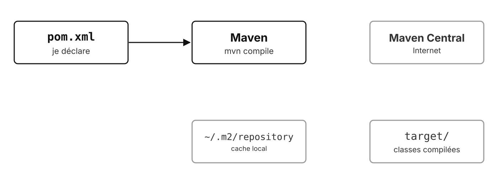
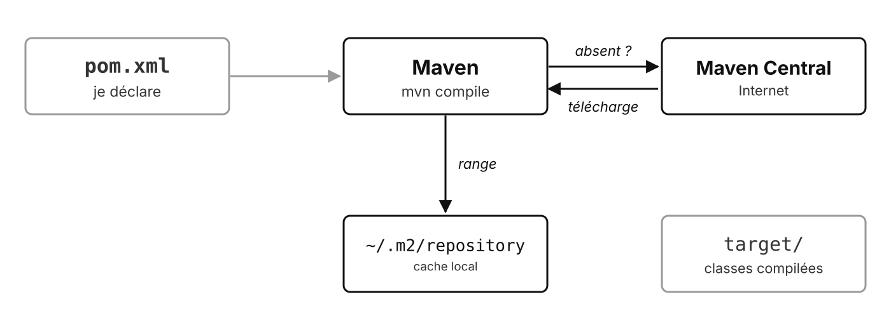
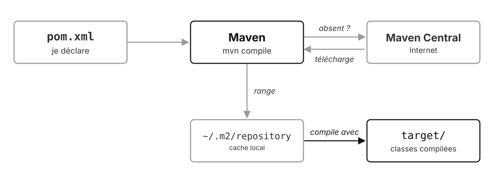
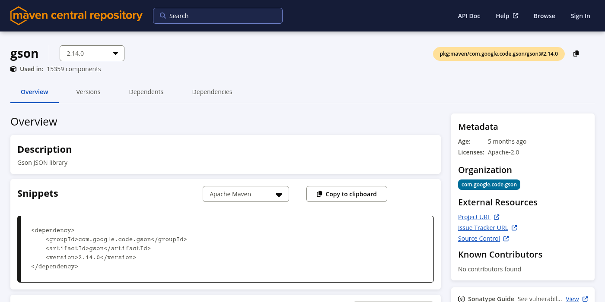
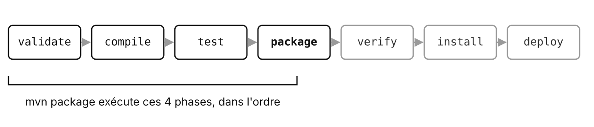

# Maven

Construire le projet et gérer ses bibliothèques

---

## Sans gestionnaire de dépendances

- Rechercher la bibliothèque, télécharger le **JAR**
- Trouver **ses** dépendances, les télécharger aussi
- Choisir des versions **compatibles**
- Configurer le projet… sur chaque poste

<!-- Et recommencer à chaque mise à jour. -->

---

## Maven, c'est quoi ?

- Un outil **Apache**, depuis 2004
- **Construire** le projet : compiler, tester, empaqueter
- **Gérer les dépendances** : téléchargement, versions, transitives
- **Convention plutôt que configuration** : une structure de dossiers standard
- Un seul fichier de description : `pom.xml`

<!-- `src/main/java`,  `src/test/java` ,  `target/` : le même partout, on s'y retrouve dans n'importe quel projet Maven. -->

---

## Comment ça marche

<v-switch>
  <template #0></template>
  <template #1></template>
  <template #2></template>
</v-switch>

<!-- Le cache local est partagé entre tous les projets du poste : téléchargé une seule fois. -->

---

## Installation : prérequis

- Un **JDK** (Java 21 dans ce module)
- `JAVA_HOME` configuré, ou `java` dans le `PATH`

```bash
java -version
mvn -v
```

Version actuelle : **Maven 3.9.16**

---

## Installation par OS

| OS | Commande |
| --- | --- |
| Debian, Ubuntu | `sudo apt install maven` |
| Fedora | `sudo dnf install maven` |
| macOS | `brew install maven` |
| Windows | `choco install maven` ou `scoop install maven` |
| Tous | archive à décompresser, `bin/` dans le `PATH` |

<!-- Les paquets des distributions peuvent avoir une version plus ancienne (Ubuntu 24.04 : 3.8). Vérifier avec `mvn -v. SDKMAN` (`sdk install maven`) : autre option Linux / macOS. -->

---

## Installation avec Docker

Rien à installer, sauf Docker :

```bash
docker run --rm -it -v "$PWD":/app -w /app \
  maven:3.9.16-eclipse-temurin-21 mvn package
```

- Image officielle : Maven **et** le JDK
- Ajouter `-v maven-repo:/root/.m2` pour garder le cache entre deux lancements

<!-- Le dépôt du formateur a un docker-compose.yml qui fait tout ça. -->

---

## Installation avec l'IDE

| IDE | Maven |
| --- | --- |
| IntelliJ IDEA | intégré, rien à installer |
| Eclipse | intégré (m2e) |
| VS Code | extension **Extension Pack for Java**, Maven installé à part ou Wrapper |

Un JDK reste nécessaire dans tous les cas

---

## Le fichier pom.xml

```xml {1-3|5-8|10-16|all}
<groupId>fr.cesi.demo</groupId>
<artifactId>demo-maven-commandes</artifactId>
<version>1.0.0</version>

<properties>
    <maven.compiler.source>21</maven.compiler.source>
    <maven.compiler.target>21</maven.compiler.target>
</properties>

<dependencies>
    <dependency>
        <groupId>org.apache.commons</groupId>
        <artifactId>commons-lang3</artifactId>
        <version>3.20.0</version>
    </dependency>
</dependencies>
```

<!--
- Clic 1 : l'identité du projet. 
- Clic 2 : la version de Java. 
- Clic 3 : les dépendances.

Extrait : le vrai fichier a aussi l'en-tête `<project>`, modelVersion 4.0.0, packaging jar, l'encodage UTF-8.
-->

---

## Les coordonnées : GAV

| | Rôle | Exemple |
| --- | --- | --- |
| `groupId` | organisation, nom de domaine inversé | `com.google.code.gson` |
| `artifactId` | nom de la bibliothèque | `gson` |
| `version` | version précise | `2.14.0` |

Trois informations pour identifier **n'importe quel** JAR

---

## Trouver une dépendance



<p class="credit">central.sonatype.com : le bloc à copier dans le pom.xml</p>

---

## Les commandes

| Commande | Effet |
| --- | --- |
| `mvn compile` | compile dans `target/classes` |
| `mvn test` | compile et lance les tests |
| `mvn package` | crée le JAR dans `target/` |
| `mvn clean` | supprime `target/` |
| `mvn dependency:tree` | affiche l'arbre des dépendances |

---

## Le cycle de vie



Une phase exécute **toutes les précédentes**

<!-- mvn package lance donc les tests : un test en échec bloque le JAR. -->

---

## Dépendances transitives

```text
fr.cesi:demo:jar:1.0
+- org.apache.poi:poi:jar:5.4.1:compile
|  +- commons-codec:commons-codec:jar:1.18.0:compile
|  +- org.apache.commons:commons-collections4:jar:4.4:compile
|  +- org.apache.commons:commons-math3:jar:3.6.1:compile
|  +- commons-io:commons-io:jar:2.18.0:compile
|  +- com.zaxxer:SparseBitSet:jar:1.3:compile
|  \- org.apache.logging.log4j:log4j-api:jar:2.24.3:compile
\- com.google.code.gson:gson:jar:2.13.1:compile
   \- com.google.errorprone:error_prone_annotations:jar:2.38.0:compile
```

`mvn dependency:tree` : 2 dépendances déclarées, 9 JAR au total

---

## Le Maven Wrapper

```bash
mvn wrapper:wrapper   # une fois, ajoute mvnw, mvnw.cmd et .mvn/
./mvnw package        # Linux, macOS
mvnw.cmd package      # Windows
```

- **La même version** de Maven pour toute l'équipe
- Télécharge Maven au premier lancement : rien à installer
- `mvnw`, `mvnw.cmd` et `.mvn/` sont **versionnés** avec le projet

---

## Pour aller plus loin

---

## Les scopes

| Scope | Disponible pour | Exemple |
| --- | --- | --- |
| `compile` (défaut) | tout | Gson |
| `test` | les tests seulement | JUnit |
| `provided` | compilation, fourni à l'exécution | API d'un serveur |
| `runtime` | exécution seulement | pilote JDBC |

```xml
<scope>test</scope>
```

---

## Les versions

**MAJEUR.MINEUR.CORRECTIF** (versionnage sémantique)

| Change | Signifie |
| --- | --- |
| `2.24.3` → `2.24.4` | correctif, sans risque |
| `2.24` → `2.25` | nouveautés compatibles |
| `2.x` → `3.0` | **rupture** : le code peut casser |
| `1.1.0-SNAPSHOT` | en cours de développement, pas en production |

---

## Maven et Gradle

| | Maven | Gradle |
| --- | --- | --- |
| Description | XML (`pom.xml`) | script Groovy ou Kotlin |
| Philosophie | conventions, déclaratif | flexible, programmable |
| Usage | standard Java historique | Android, gros projets |
| Dépôt | Maven Central | Maven Central aussi |

---

## Des questions ?

---

## Sources

- [maven.apache.org](https://maven.apache.org/) : [installation](https://maven.apache.org/install.html), [téléchargement](https://maven.apache.org/download.cgi), [cycle de vie](https://maven.apache.org/guides/introduction/introduction-to-the-lifecycle.html), [scopes](https://maven.apache.org/guides/introduction/introduction-to-dependency-mechanism.html)
- [Maven Wrapper](https://maven.apache.org/tools/wrapper/)
- [Maven Central](https://central.sonatype.com/) (capture : com.google.code.gson:gson)
- [Image Docker officielle `maven`](https://hub.docker.com/_/maven)
- [Versionnage sémantique](https://semver.org/lang/fr/)
