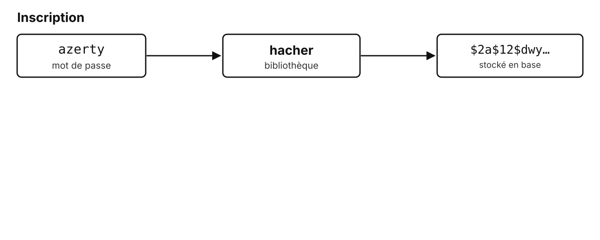
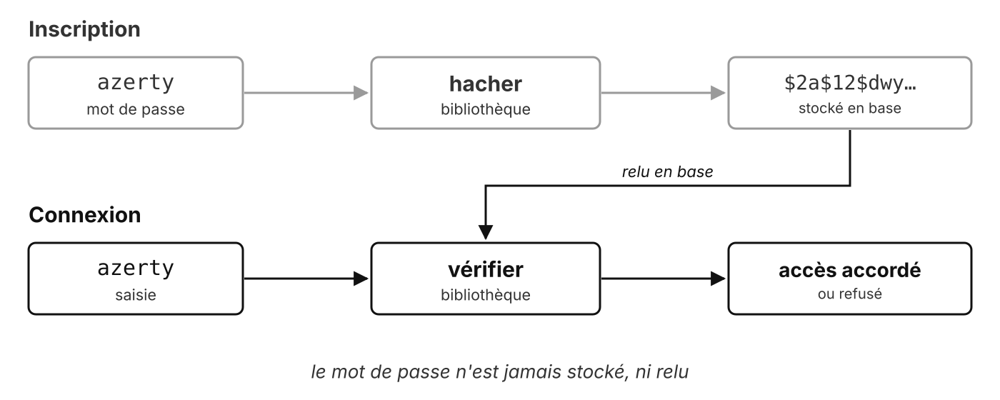
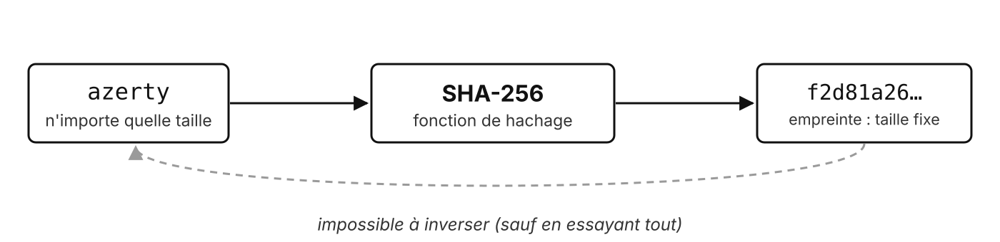
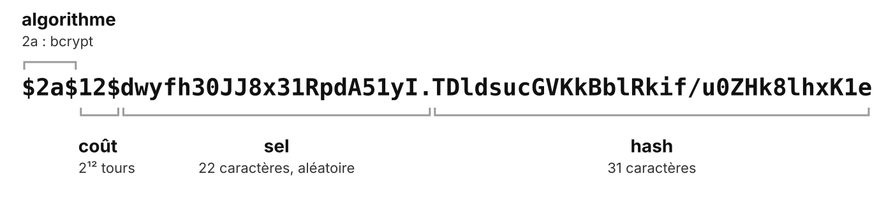
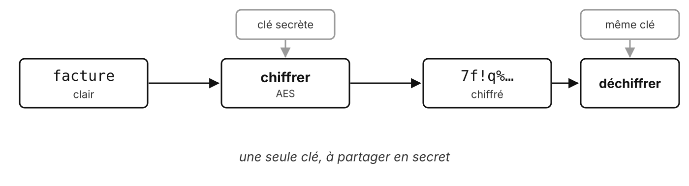
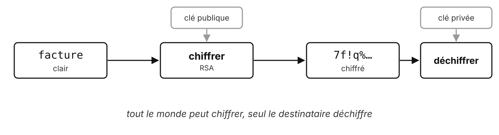
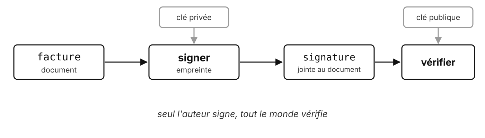

# Sécuriser l'authentification

Un mot de passe ne se stocke jamais en clair

---

## Le besoin

> « Je veux que l'accès à mon application soit protégé par un identifiant et un mot de passe. »

<!-- Deuxième besoin client, TP 5. AuthService sera repris tel quel en INFET9 pour l'écran de connexion. -->

---

## S'authentifier

**Prouver qui on est**, avec un ou plusieurs facteurs :

- ce que je **sais** : un mot de passe
- ce que je **possède** : un téléphone, une clé physique
- ce que je **suis** : une empreinte digitale

Plusieurs facteurs : authentification **multifacteur** (MFA)

---

## Le mécanisme

<v-switch>
  <template #0></template>
  <template #1></template>
</v-switch>

---

## Et si on stockait en clair ?

- Une fuite de la base, et **tous** les comptes sont ouverts
- Les utilisateurs **réutilisent** leurs mots de passe ailleurs
- RockYou, 2009 : **32 millions** de mots de passe en clair publiés

<!-- La liste RockYou sert encore aujourd'hui de dictionnaire pour les attaques. -->

---

## Le hachage



- Même entrée, **même empreinte**
- Sens unique : on ne « déhache » pas

---

## Un caractère change tout

```text
azerty  →  f2d81a260dea8a100dd517984e53c56a7523d96942a834b9cdc249bd4e8c7aa9
azertY  →  d70bf07520860919de09787e437588ebe1047c5cd62e2231a406d45df364673c
```

SHA-256 : 64 caractères hexadécimaux, quelle que soit l'entrée

<!-- Obtenu avec : `printf 'azerty' | sha256sum` -->

---

## Ne pas confondre

| | Clé | Réversible | But |
| --- | --- | --- | --- |
| **Encoder** (base64) | non | oui, par tous | représenter |
| **Hacher** (SHA-256) | non | non (force brute) | intégrité, mots de passe |
| **Chiffrer** (AES, RSA) | oui | oui, avec la clé | confidentialité |
| **Signer** (RSA, ECDSA) | oui | sans objet | authenticité, intégrité |

<!-- azerty en base64 : `YXplcnR5`. L'authentification HTTP Basic n'est que du base64 : aucune confidentialité sans HTTPS. -->

---

## Chiffrer, pas « crypter »

| Mot | Sens |
| --- | --- |
| **chiffrer** | rendre illisible sans la clé |
| **déchiffrer** | retrouver le clair **avec** la clé |
| **décrypter** | retrouver le clair **sans** la clé (casser) |
| « crypter » | chiffrer sans clé : n'a pas de sens |
| « chiffrage » | évaluer un coût, rien à voir |

<!-- 
- Le RGS de l'ANSSI qualifie « cryptage » d'incorrect.
- Exception admise par l'Académie : les chaînes de télévision « cryptées ». « Encrypter » : anglicisme. -->

---

## Pourquoi pas MD5 ou SHA-256 ?

- **Trop rapides** : des dizaines de milliards d'essais par seconde sur une carte graphique
- **Tables arc-en-ciel** : empreintes précalculées des mots de passe courants
- Deux utilisateurs, même mot de passe : **même empreinte**

<!-- MD5 et SHA-1 sont en plus cassés (collisions) : à éviter pour tout usage (CNIL).

SHA-256 reste bon pour l'intégrité, pas pour les mots de passe. -->

---

## Le sel

Une valeur **aléatoire**, différente pour chaque mot de passe, stockée avec le hash

```text
azerty  →  $2a$12$dwyfh30JJ8x31RpdA51yI.TDldsucGVKkBblRkif/u0ZHk8lhxK1e
azerty  →  $2a$12$bsLIeBWDu00O7bO/zGoHTeGKDmtpTVt833XliVtXqsq90SVNm7NGu
```

Même mot de passe, **empreintes différentes** : les tables précalculées ne servent plus à rien

---

## Des fonctions lentes, exprès

| Algorithme | Année | Recommandation OWASP |
| --- | --- | --- |
| **Argon2id** | 2015 | premier choix |
| scrypt | 2009 | à défaut |
| **bcrypt** | 1999 | systèmes existants, coût ≥ 10 |
| PBKDF2 | 2000 | si conformité FIPS imposée |

bcrypt coût 12 : **~240 ms** par essai

<!-- Mesuré avec la bibliothèque bcrypt Java (at.favre.lib) dans le conteneur du module. Argon2 : gagnant de la Password Hashing Competition (2015). -->

---

## Lire un hash bcrypt



Tout est dans la chaîne : **une seule colonne** en base suffit

---

## Les règles

- **Jamais** de mot de passe en clair, même temporairement
- Une **bibliothèque éprouvée**, jamais d'algorithme maison
- **Argon2id** ou **bcrypt**, pas MD5 ni SHA seuls
- Vérifier avec la fonction de la bibliothèque, pas en recalculant soi-même
- Message d'erreur unique : « identifiant **ou** mot de passe incorrect »

<!-- La vérification de la bibliothèque compare en temps constant (pas d'attaque par chronométrage). Le message unique évite de révéler quels identifiants existent. -->

---

## Pour aller plus loin

---

## Chiffrement symétrique



Rapide, mais comment **partager la clé** en secret ?

<!-- CNIL : AES (clés de 128, 192 ou 256 bits) ou ChaCha20. -->

---

## Chiffrement asymétrique



Une paire de clés : la **publique** se diffuse, la **privée** ne quitte jamais son propriétaire

<!-- CNIL : RSA-OAEP, modules de 2048 bits minimum (3072 conseillé). Plus lent que le symétrique. -->

---

## Signature



**Intégrité**, **authenticité**, **non-répudiation**

<!-- On signe l'empreinte (hash) du document, pas le document entier. CNIL : RSA-SSA-PSS ou ECDSA. -->

---

## HTTPS combine tout

- **Asymétrique** : échanger une clé de session
- **Symétrique** : chiffrer les échanges avec cette clé
- **Signature** : le certificat du serveur, signé par une autorité
- **Hachage** : l'intégrité de chaque message

---

## Des questions ?

---

## Sources

- CNIL, [Chiffrement, hachage, signature](https://www.cnil.fr/fr/securite-chiffrement-hachage-signature)
- OWASP, [Password Storage Cheat Sheet](https://cheatsheetseries.owasp.org/cheatsheets/Password_Storage_Cheat_Sheet.html)
- PHP, [FAQ sur le hachage des mots de passe](https://www.php.net/manual/fr/faq.passwords.php)
- [chiffrer.info](https://web.archive.org/web/20260219024320/https://chiffrer.info/) (archive), d'après le RGS de l'ANSSI
- Empreintes et hash : `sha256sum`, bibliothèque bcrypt Java 0.10.2
