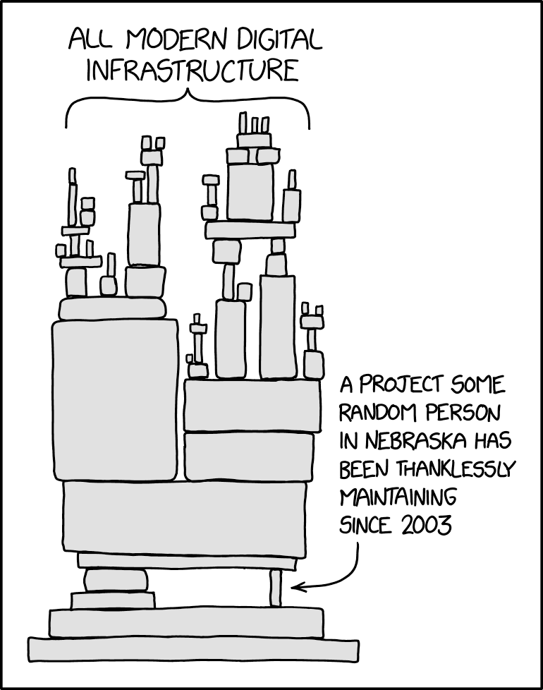
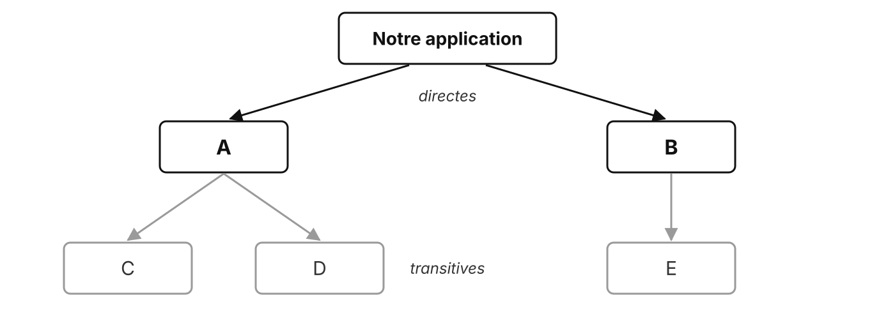
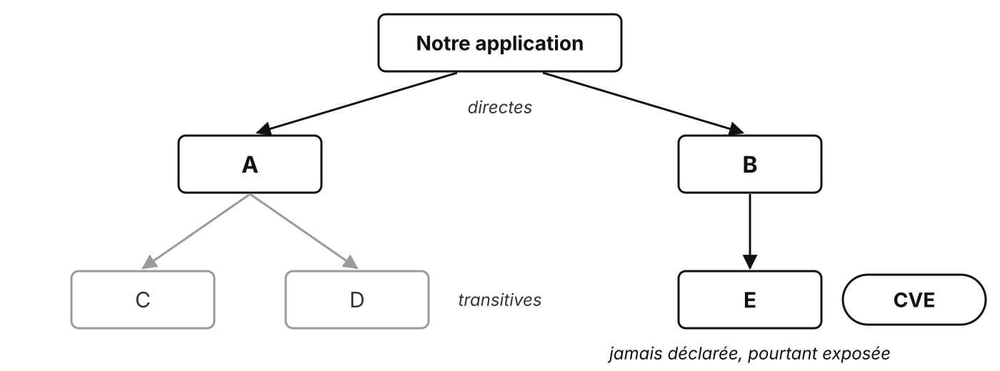
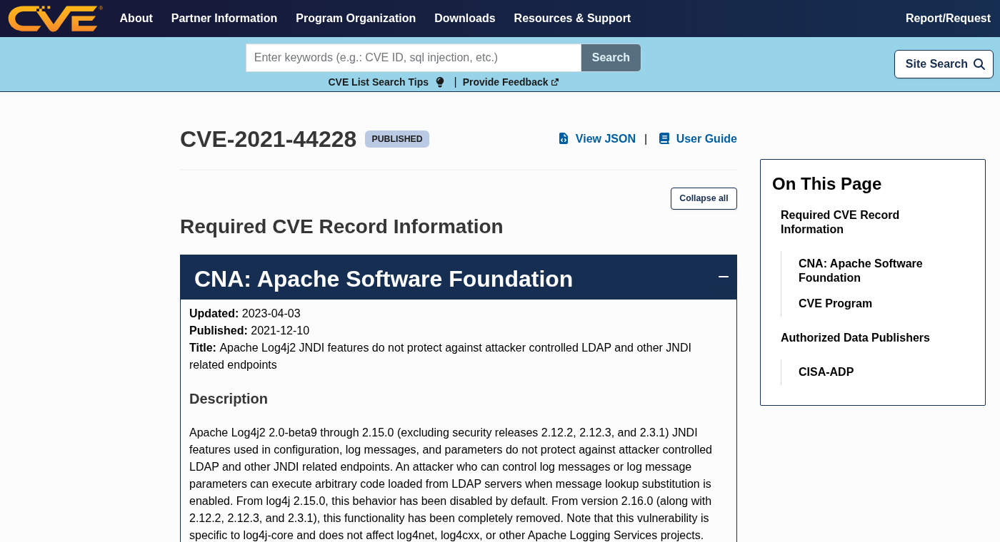

# Sécurité des dépendances

Une bibliothèque n'est pas qu'un JAR

---

## Et si on choisit mal ?

- Bibliothèque **abandonnée** : plus de correctifs
- **Vulnérabilité** connue, ou découverte plus tard
- **Incompatibilité** avec le reste du projet
- Dépendances transitives **problématiques**
- **Licence** inadaptée au projet
- **Dépendance excessive** à une API difficile à remplacer

<!-- D'abord faire lister les risques par le groupe, puis afficher. -->

---

## Tout repose sur quelqu'un



<p class="credit">Randall Munroe, xkcd 2347 « Dependency », CC BY-NC 2.5</p>

<!-- « Un projet qu'une personne au hasard dans le Nebraska maintient sans remerciements depuis 2003. » Exactement ce qui s'est passé avec xz-utils (plus loin). -->

---

## Directes et transitives

<v-switch>
  <template #0></template>
  <template #1></template>
</v-switch>

<!-- Une vulnérabilité dans une dépendance indirecte concerne quand même l'application. `mvn dependency:tree` pour la voir. -->

---

## Les notions

| Notion | Définition |
| --- | --- |
| **Vulnérabilité** | faille exploitable par un attaquant |
| **CVE** | identifiant public unique d'une vulnérabilité |
| **Version vulnérable** | version où la faille existe |
| **Version corrigée** | première version sans la faille |
| **Analyse des dépendances** | comparer ses versions aux CVE connues |

---

## Les CVE

- **Common Vulnerabilities and Exposures** : un catalogue public, depuis 1999
- Un identifiant par faille : **CVE-année-numéro**
- Une gravité : le score **CVSS**, de 0 à 10

| Score | 0,1 à 3,9 | 4,0 à 6,9 | 7,0 à 8,9 | 9,0 à 10 |
| --- | --- | --- | --- | --- |
| Gravité | faible | moyenne | élevée | **critique** |

<!-- Géré par MITRE, financé par le gouvernement américain (CISA). Le score vient surtout de la NVD (NIST). -->

---

## Une fiche CVE



<p class="credit">cve.org : CVE-2021-44228, versions concernées, description</p>

---

## Log4Shell, décembre 2021

- **Log4j** : la bibliothèque de logs Java la plus utilisée
- Un simple texte **journalisé** pouvait faire exécuter du code à distance
- CVE-2021-44228, CVSS **10** : le maximum
- Des centaines de millions de systèmes concernés, souvent **sans le savoir** (transitive)
- Correction : passer à **2.17.1**

---

## xz-utils, mars 2024

- Bibliothèque de compression, présente dans presque tous les Linux
- Un contributeur gagne la **confiance** du mainteneur, seul et épuisé, pendant **2 ans**
- Il glisse une **porte dérobée** visant SSH (versions 5.6.0 et 5.6.1)
- Découverte **par hasard** : une connexion SSH plus lente d'une demi-seconde
- CVE-2024-3094, CVSS **10**

<!-- Andres Freund, développeur PostgreSQL, a remarqué la lenteur.

Attaque de la chaîne d'approvisionnement (supply chain) : le code malveillant arrive par une dépendance de confiance. -->

---

## OWASP

**Open Worldwide Application Security Project**

- Fondation à but non lucratif, depuis 2001
- Des ressources **libres et gratuites** sur la sécurité des applications
- **Top 10** des risques, **Cheat Sheets**, outils

---

## OWASP Top 10 : 2025

| | Risque |
| --- | --- |
| A01 | Broken Access Control |
| **A03** | **Software Supply Chain Failures** |
| A04 | Cryptographic Failures |
| A07 | Authentication Failures |

Les dépendances vulnérables : **3ᵉ risque** des applications web

<!-- Extrait : 4 des 10 (A02 : Security Misconfiguration). 

A04 et A07 rejoignent le TP 5 (hachage, authentification).

En 2021, « Vulnerable and Outdated Components » était 6ᵉ. -->

---

## OWASP Dependency-Check

Compare les dépendances du projet aux CVE connues

```bash
mvn org.owasp:dependency-check-maven:check
```

- Rapport : `target/dependency-check-report.html`
- Premier lancement **long** : téléchargement de la base NVD
- Une clé d'API NVD (gratuite) accélère les mises à jour

---

## Les bons réflexes

| Quand | Réflexe |
| --- | --- |
| Avant de choisir | activité du projet, CVE connues, licence |
| En l'ajoutant | `mvn dependency:tree` : que vient-il avec ? |
| Ensuite | surveiller les CVE, **mettre à jour** régulièrement |

> **Choisir une bibliothèque est aussi un choix de maintenance et de sécurité.**

---

## Pour aller plus loin

---

## Surveiller automatiquement

| Outil | Rôle |
| --- | --- |
| OWASP Dependency-Check | rapport des CVE connues |
| GitHub Dependabot | alertes et mises à jour proposées |
| Renovate | mises à jour automatiques |
| `mvn versions:display-dependency-updates` | versions plus récentes disponibles |

---

## SBOM

**Software Bill of Materials** : la liste de tous les composants d'un logiciel

- Comme une liste d'ingrédients : versions, licences, origine
- Format ouvert **CycloneDX** (OWASP)
- Exigé par le **Cyber Resilience Act** européen (fin 2027)

---

## D'autres bases

| Base | Intérêt |
| --- | --- |
| [NVD](https://nvd.nist.gov/) (NIST) | scores CVSS, versions concernées |
| [GitHub Advisory Database](https://github.com/advisories) | par écosystème (Maven, npm…) |
| [OSV.dev](https://osv.dev/) | base ouverte, multi-écosystèmes |
| [CERT-FR](https://www.cert.ssi.gouv.fr/) | avis de sécurité **en français** |

---

## Des questions ?

---

## Sources

- [cve.org](https://www.cve.org/) : [CVE-2021-44228](https://www.cve.org/CVERecord?id=CVE-2021-44228), [CVE-2024-3094](https://www.cve.org/CVERecord?id=CVE-2024-3094)
- [OWASP Top 10:2025](https://top10.owasp.org/2025), [OWASP Dependency-Check](https://owasp.org/www-project-dependency-check/)
- [NVD, échelle CVSS](https://nvd.nist.gov/vuln-metrics/cvss)
- xkcd 2347 [Dependency](https://xkcd.com/2347/), Randall Munroe, [CC BY-NC 2.5](https://creativecommons.org/licenses/by-nc/2.5/)
- [CycloneDX](https://cyclonedx.org/), [Cyber Resilience Act](https://digital-strategy.ec.europa.eu/fr/policies/cyber-resilience-act)
