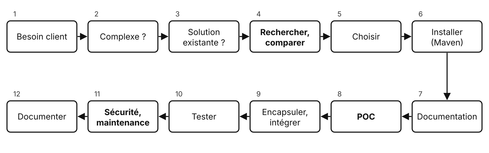

# Bilan du module

Deux jours, trois besoins client, trois bibliothèques

---

## L'application de facturation

| Besoin client | Réalisé |
| --- | --- |
| Retrouver ses factures | persistance SQLite (`InvoiceRepository`) |
| Factures en PDF | `InvoicePdfService` |
| Accès protégé | `AuthService`, mot de passe haché |
| Envoi par e-mail | PDF en pièce jointe |

<!-- AuthService est repris tel quel en INFET9 pour l'écran de connexion. -->

---

## La démarche à retenir

<!-- Parcourue trois fois : PDF, hachage, e-mail. Les étapes en gras sont celles qu'on oublie le plus souvent. -->

---

## Notions

| Thème | Notions |
| --- | --- |
| Bibliothèques | bibliothèque, framework, API, JAR |
| Maven | pom.xml, GAV, Maven Central, transitives |
| Intégration | POC, encapsulation dans un service |
| Authentification | hachage, sel, bcrypt, Argon2 |
| Dépendances | vulnérabilité, CVE, CVSS, OWASP |

--- | --- |
| Bibliothèques | bibliothèque, framework, API, JAR, dépendance |
| Maven | `pom.xml`, GAV, Maven Central, cycle de vie, dépendance transitive, Wrapper |
| Intégration | POC, encapsulation (`InvoicePdfService`, `AuthService`) |
| Authentification | hachage, sel, bcrypt, Argon2, encoder, chiffrer, signer |
| Sécurité des dépendances | vulnérabilité, CVE, CVSS, OWASP, Dependency-Check |

---

## Pour aller plus loin

---

## Des ressources à garder

| Ressource | Pour |
| --- | --- |
| [Maven Central](https://central.sonatype.com/) | trouver une bibliothèque |
| [cve.org](https://www.cve.org/), [CERT-FR](https://www.cert.ssi.gouv.fr/) | les vulnérabilités |
| [OWASP Cheat Sheets](https://cheatsheetseries.owasp.org/) | les bonnes pratiques de sécurité |
| [CNIL](https://www.cnil.fr/fr/securite-chiffrement-hachage-signature) | chiffrement, hachage, signature |

---

## Des questions ?

---

## Sources

- Fiche module INFET10 (CESI)
- Les présentations du module : bibliothèques, Maven, authentification, sécurité des dépendances
