# Le client lourd

Des câbles à la fenêtre : et pourquoi encore des applications installées ?

---

## Un peu d'histoire

<v-switch>
  <template #0>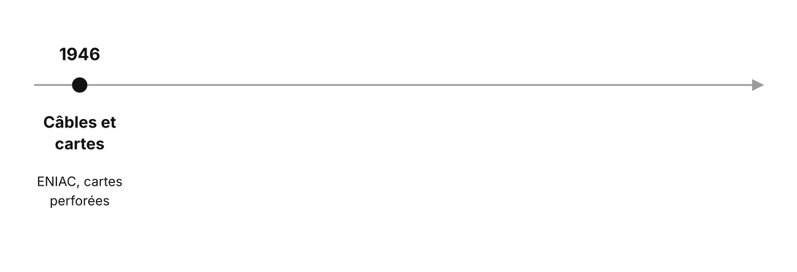</template>
  <template #1>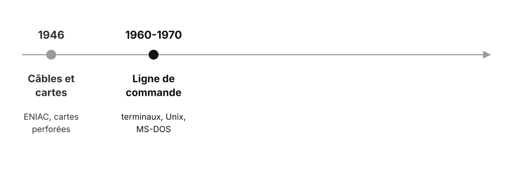</template>
  <template #2>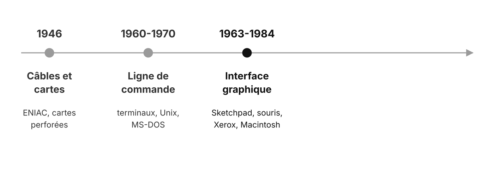</template>
  <template #3>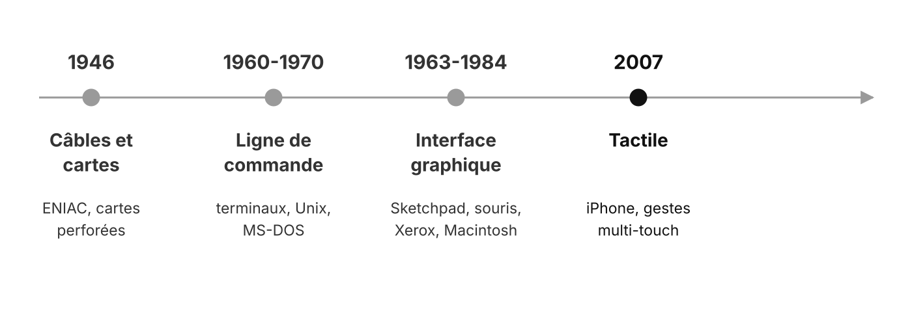</template>
  <template #4>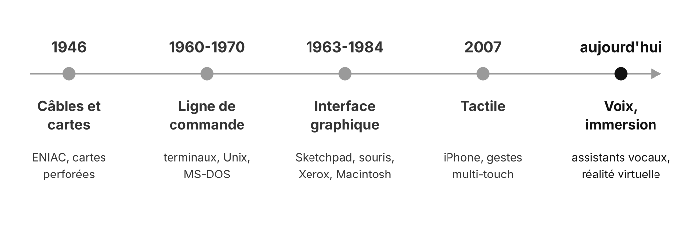</template>
</v-switch>

<!-- 5 minutes, pas plus. Le modèle WIMP (Windows, Icons, Menus, Pointer) formalisé chez Xerox PARC dans les années 1970 : c'est encore lui qu'on programme en JavaFX. -->

---

## En images

<v-switch>
<template #0>
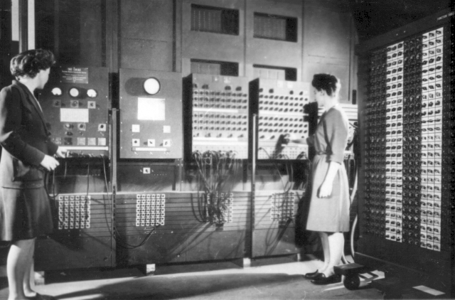

ENIAC, 1946 : on programme avec des câbles. US Army, domaine public

</template>
<template #1>
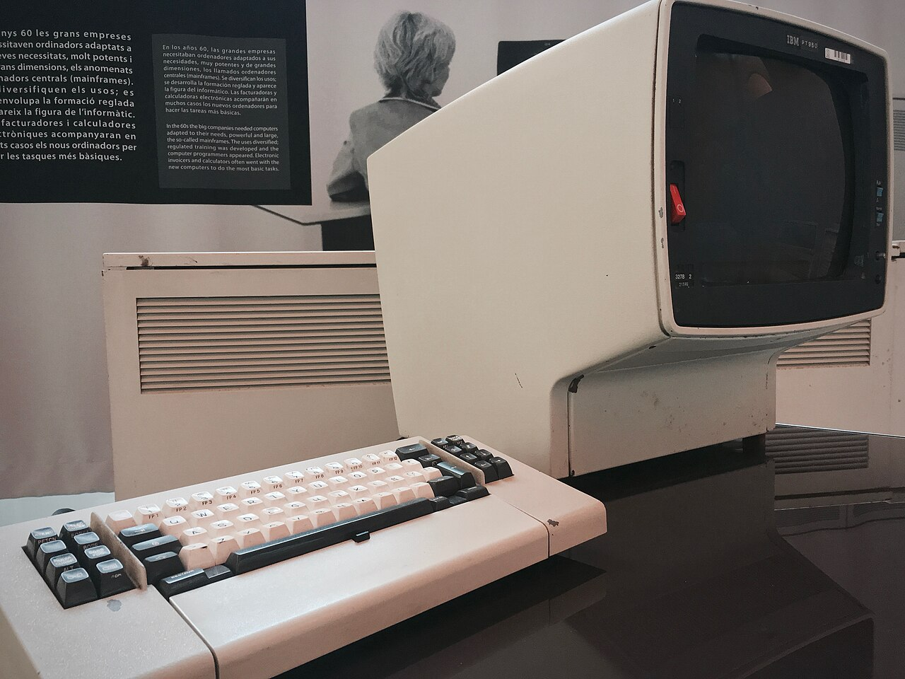

Terminal IBM 3278 : du texte à l'écran. Marcin Wichary, CC BY 2.0

</template>
<template #2>
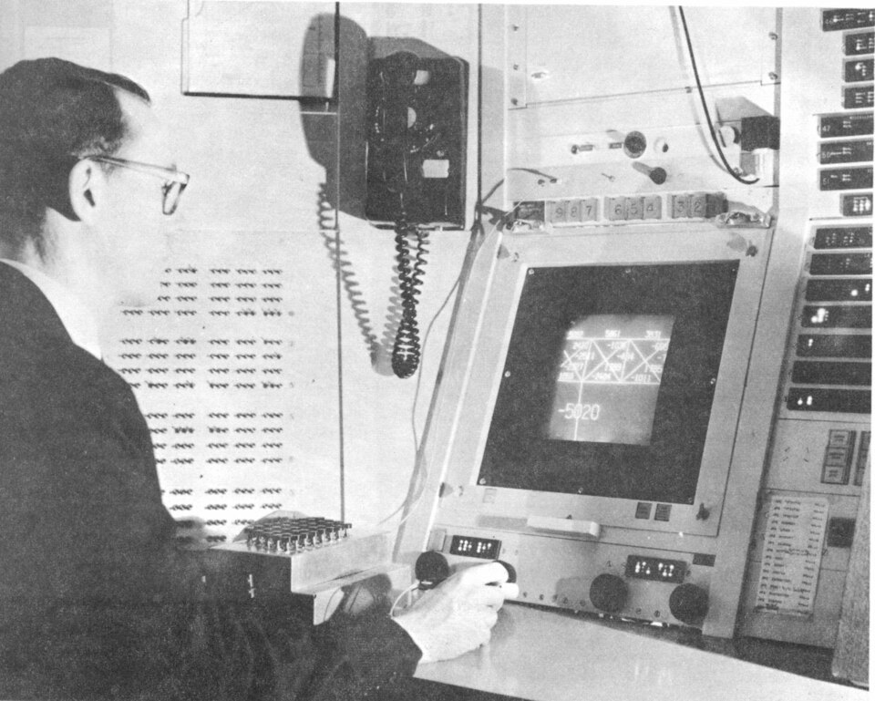

Sketchpad, 1963 : première interface graphique interactive. Ivan Sutherland (scan K. Rodden), CC BY-SA 3.0

</template>
<template #3>
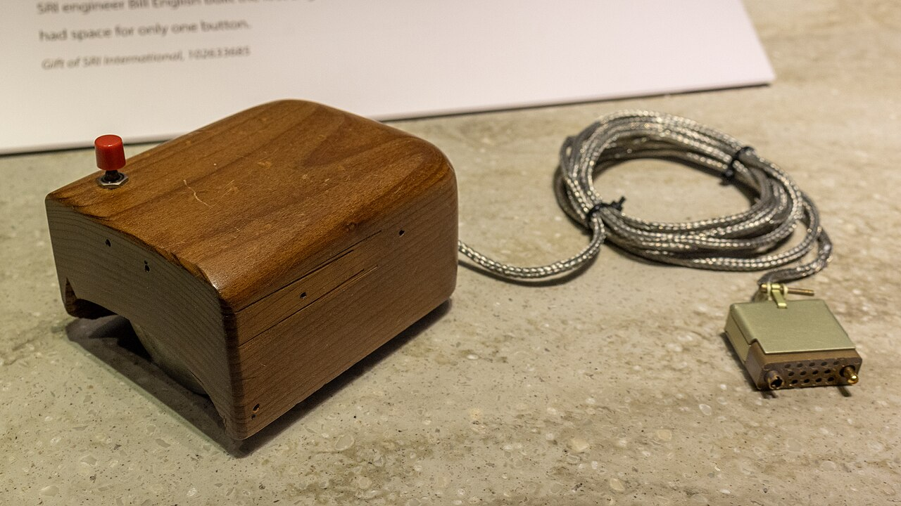

La souris de Douglas Engelbart (réplique), 1964. The wub, CC BY-SA 4.0

</template>
<template #4>
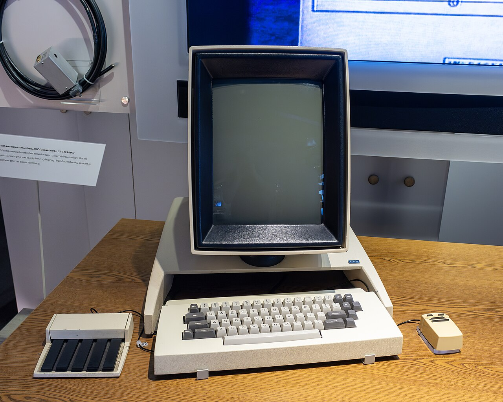

Xerox Alto, 1973 : fenêtres, icônes, menus, souris. The wub, CC BY-SA 4.0

</template>
<template #5>
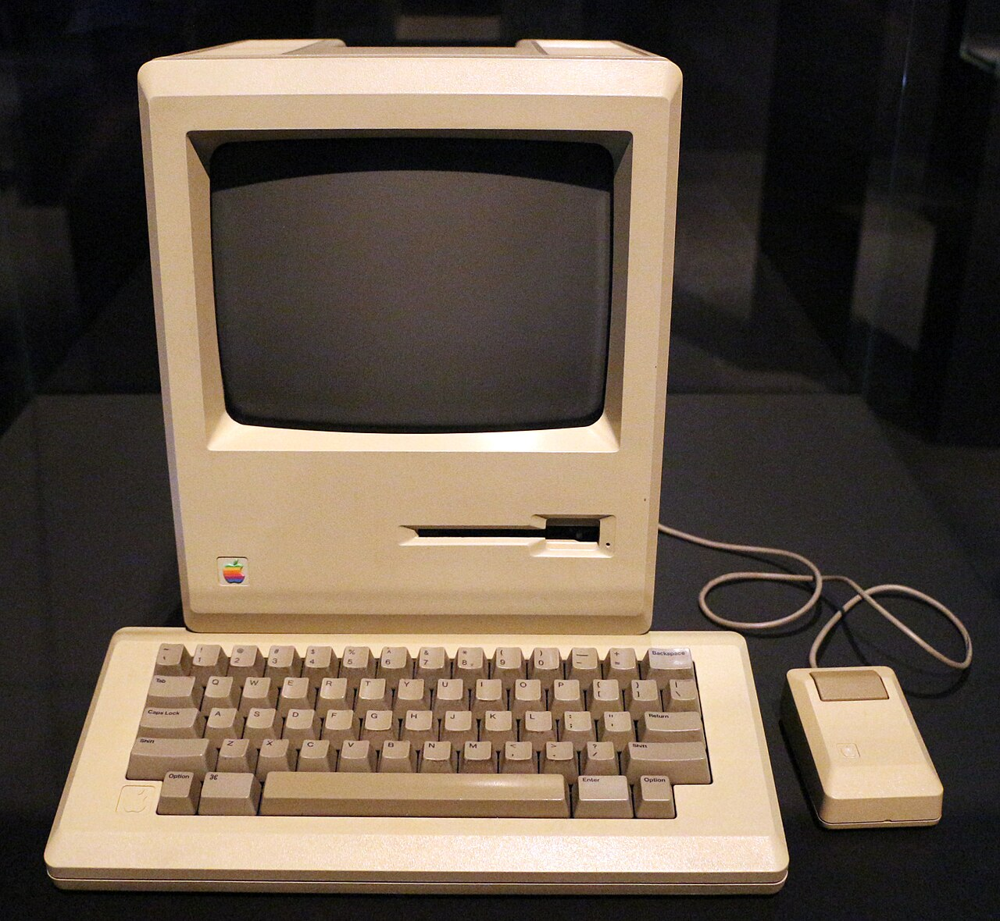

Macintosh, 1984 : l'interface graphique pour le grand public. Sailko, CC BY 3.0

</template>
<template #6>
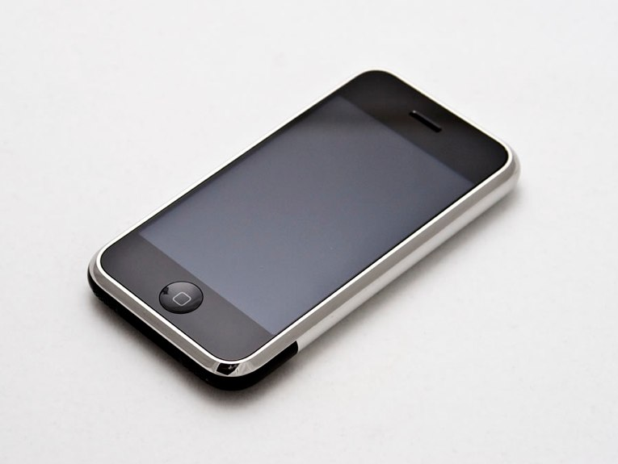

iPhone, 2007 : le doigt remplace la souris. Carl Berkeley, CC BY-SA 2.0

</template>
</v-switch>

---

## Deux familles d'applications

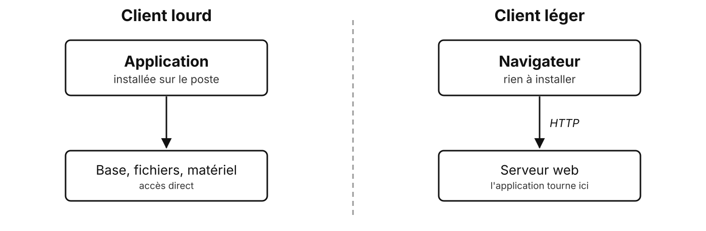

---

## Lourd ou léger ?

| Critère | Client lourd | Client léger (web) |
| --- | --- | --- |
| Installation | sur le poste | un navigateur suffit |
| Accès au système | direct | limité (sandbox) |
| Mises à jour | sur chaque poste | centralisées |
| Hors ligne | possible | selon l'application |
| Portabilité | selon la techno | multiplateforme |

<!-- Demander d'abord aux apprenants des exemples de chaque famille qu'ils utilisent. -->

---

## Encore du client lourd aujourd'hui ?

- **Accès direct** au poste : fichiers, imprimantes, lecteurs de cartes
- **Performances** : calcul, affichage de gros volumes
- **Hors ligne** : caisses, terminaux de terrain
- Exemples : IDE, logiciels de gestion, suites bureautiques, CAO

---

## Panorama des bibliothèques graphiques

| Écosystème | Bibliothèques |
| --- | --- |
| Java | **Swing**, **JavaFX**, SWT |
| .NET | **WinForms**, **WPF**, MAUI, Avalonia |
| C, C++ | Qt, GTK, wxWidgets |
| Python | Tkinter, PySide (Qt) |
| Multiplateforme | Electron, Tauri, Flutter, Compose Multiplatform |

<!-- 
- Swing : IntelliJ IDEA.
- SWT : Eclipse.
- Qt : VLC, KDE.
- GTK : GNOME, GIMP.
- Electron : VS Code, Slack. -->

---

## Pourquoi JavaFX pour ce module ?

- La suite d'INFET10 : **Java**, **Maven**, les mêmes services métier
- **Data binding** natif, feuilles de style **CSS**, **FXML** déclaratif
- Un outil visuel, **Scene Builder**, sans perdre la main sur le code
- Open source, maintenu, multiplateforme (Windows, macOS, Linux)

---

## Pour aller plus loin

---

## Le web sur le bureau

| | Principe | Exemples |
| --- | --- | --- |
| **Electron** | un navigateur Chromium embarqué + Node.js | VS Code, Slack, Discord |
| **Tauri** | la vue web du système + Rust, plus léger | applications récentes |
| **Flutter** | un seul code pour mobile, web et bureau | Google |

Une application « lourde » écrite avec les technologies du web

---

## Des questions ?

---

## Sources

- Photos : [Wikimedia Commons](https://commons.wikimedia.org/), licences indiquées sous chaque image (ENIAC : US Army ; IBM 3278 : Marcin Wichary ; Sketchpad : Ivan Sutherland, scan Kerry Rodden ; souris, Xerox Alto : The wub ; Macintosh : Sailko ; iPhone : Carl Berkeley)
- Notes du module : petite histoire des interfaces utilisateur
- [OpenJFX](https://openjfx.io/)
