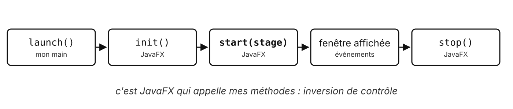
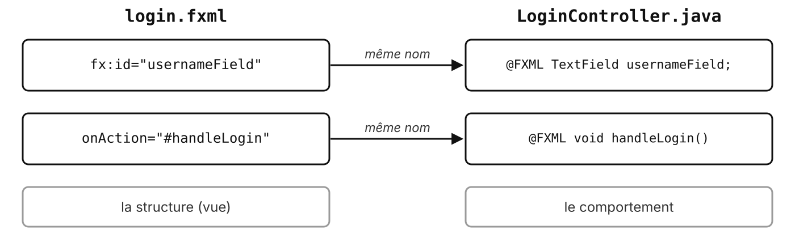
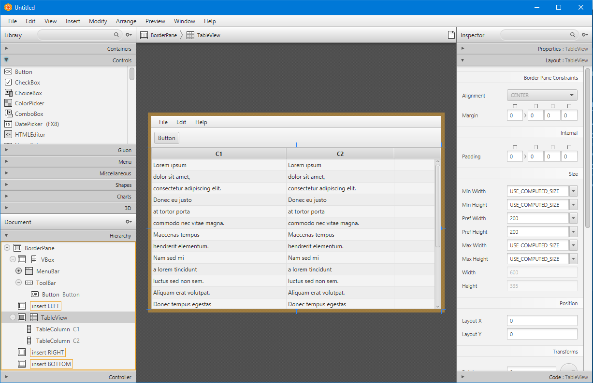

# JavaFX

Le framework graphique de Java

---

## JavaFX, c'est quoi ?

- Le framework d'**interfaces graphiques** de Java, successeur de Swing
- Né en 2008, intégré au JDK de Java 8 à Java 10
- Depuis Java 11 : projet séparé et **open source**, **OpenJFX**
- Maintenu par Gluon et Oracle, une version tous les 6 mois

Ce module : **JavaFX 21**, version à support long, comme Java 21

---

## Un framework



On ne l'appelle pas : **il nous appelle** (INFET10 : bibliothèque vs framework)

<!-- On écrit `start(stage)` ; on ne l'appelle jamais soi-même. Même principe pour les méthodes `handleXxx` d'un Controller. -->

---

## Installation avec Maven

**Deux dépendances** et un **plugin**, rien d'autre à installer

```xml
<dependency>
    <groupId>org.openjfx</groupId>
    <artifactId>javafx-controls</artifactId>
    <version>21.0.12</version>
</dependency>
<dependency>
    <groupId>org.openjfx</groupId>
    <artifactId>javafx-fxml</artifactId>
    <version>21.0.12</version>
</dependency>
```

<!-- Maven télécharge aussi les bibliothèques natives de l'OS (Windows, macOS, Linux) : rien à installer à part. -->

---

## Lancer l'application

| Où | Comment |
| --- | --- |
| Terminal | `mvn javafx:run` (plugin `javafx-maven-plugin`) |
| IDE | panneau Maven, `javafx:run` |
| Docker (Linux) | `xhost +local:docker`, puis `mvn javafx:run` dans le conteneur |

<!-- Le plugin indique la classe principale (`mainClass`) dans le `pom.xml`. Docker : affichage via X11. -->

---

## FXML

Décrire l'écran en **XML**, séparé du code Java

```xml
<VBox spacing="12" alignment="CENTER"
      fx:controller="fr.cesi.invoicing.LoginController">
    <Label text="Application de facturation" />
    <TextField fx:id="usernameField" promptText="Identifiant" />
    <PasswordField fx:id="passwordField" promptText="Mot de passe" />
    <Button text="Se connecter" onAction="#handleLogin" />
</VBox>
```

<!-- Extrait simplifié du login.fxml des TP (sans les imports ni le Label d'erreur). -->

---

## Le contrat FXML et Controller



---

## Charger un FXML

```java
Parent root = FXMLLoader.load(getClass().getResource("login.fxml"));
stage.setScene(new Scene(root));
stage.show();
```

- Le `FXMLLoader` lit le fichier, crée les composants **et** le Controller
- Le fichier est dans `src/main/resources`, même package que la classe

---

## Scene Builder



<p class="credit">Scene Builder. Guiguidu60, CC BY-SA 4.0</p>

---

## Scene Builder en bref

- Éditeur **visuel** de FXML : glisser-déposer les composants
- Gratuit, open source, maintenu par **Gluon**
- Il **génère du FXML** : on peut toujours le retoucher à la main
- IntelliJ : onglet « Scene Builder » sur un fichier `.fxml`

<!-- Scene Builder doit être installé à part pour que l'onglet IntelliJ fonctionne. -->

---

## Pour aller plus loin

---

## Styler avec CSS

```css
.button {
    -fx-background-color: #2544b8;
    -fx-text-fill: white;
}
```

```java
scene.getStylesheets().add(getClass().getResource("style.css").toExternalForm());
```

Propriétés préfixées par `-fx-`, sélecteurs comme sur le web

---

## D'autres outils

| Outil | Principe |
| --- | --- |
| JFormDesigner | éditeur visuel commercial, JavaFX et Swing |
| ActionFX | plugin IntelliJ : aperçu FXML, assistance |
| Compose Multiplatform | Kotlin, interface 100 % en code, sans FXML |

Scene Builder reste la référence gratuite pour JavaFX

---

## Des questions ?

---

## Sources

- [OpenJFX](https://openjfx.io/), [documentation JavaFX 21](https://openjfx.io/javadoc/21/)
- [Scene Builder (Gluon)](https://gluonhq.com/products/scene-builder/) ; capture : Guiguidu60, [CC BY-SA 4.0](https://creativecommons.org/licenses/by-sa/4.0/), via [Wikimedia Commons](https://commons.wikimedia.org/wiki/File:Scene_builder.png)
- [JFormDesigner](https://www.formdev.com/jformdesigner/javafx/), [ActionFX](https://plugins.jetbrains.com/plugin/27462-actionfx), [IntelliJ et Scene Builder](https://www.jetbrains.com/help/idea/opening-fxml-files-in-javafx-scene-builder.html)
- Code : corrigés des TP 1 et 2 du module
