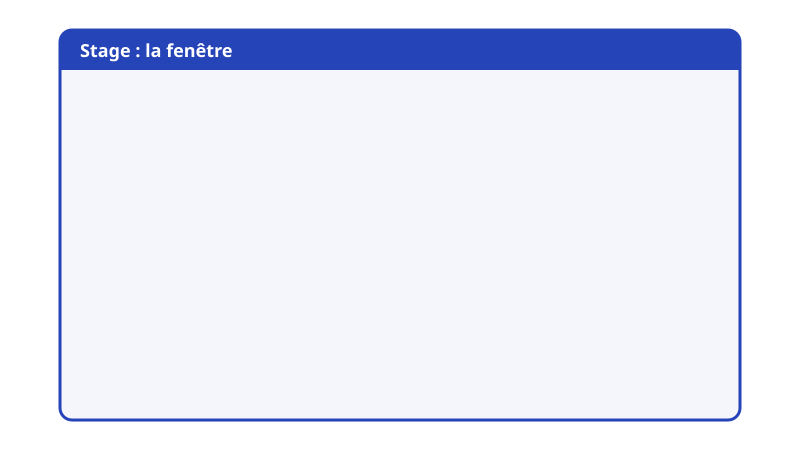
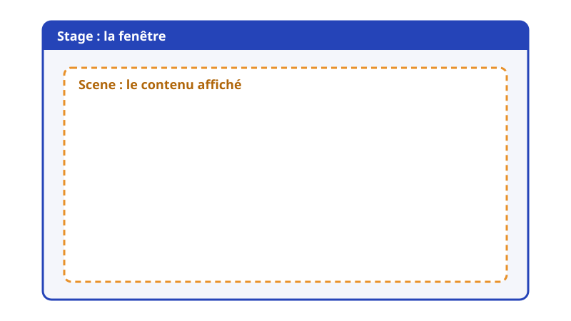
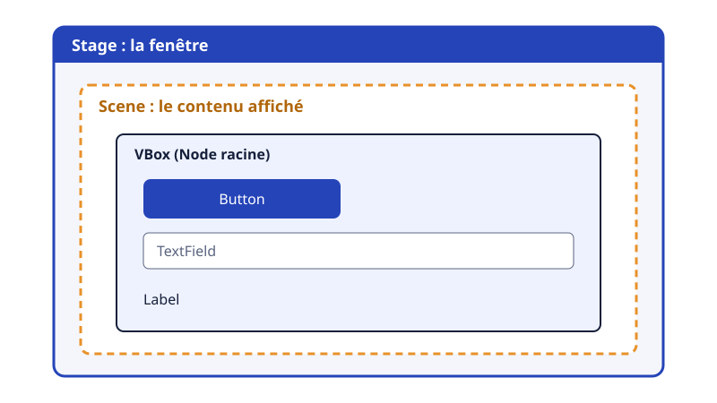
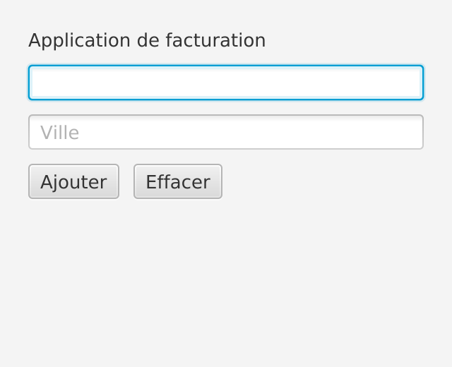
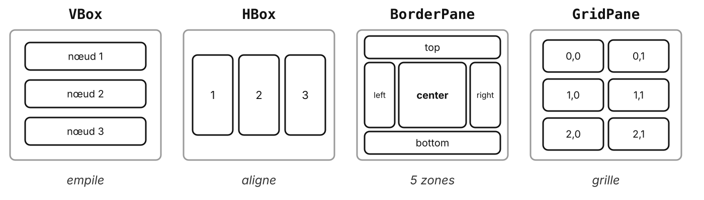

# Les bases de JavaFX

Stage, Scene, Node

---

## Les briques d'une fenêtre

<v-switch>
  <template #0></template>
  <template #1></template>
  <template #2></template>
</v-switch>

<!--
- Clic 1 : la Scene dans le Stage. 
- Clic 2 : l'arbre de Nodes.

Insister : on peut changer de Scene (ou de root) sans changer de fenêtre.
-->

---

## En code

```java {1-2|3-4|5-6|all}
public class InvoiceApp extends Application {
    @Override public void start(Stage stage) {
        Button button = new Button("Nouvelle facture");
        VBox root = new VBox(button);
        stage.setScene(new Scene(root));
        stage.show();
    }
}
```

<!-- Faire le lien avec le schéma précédent à chaque étape. -->

---

## Le résultat (TP 1)



<p class="credit">Corrigé du TP 1 : JavaFX en code pur, sans FXML</p>

---

## Les layouts de base



<!-- Un layout est lui-même un Node : on les imbrique (une HBox de boutons dans une VBox, TP 1). -->

---

## Les événements

Un clic, une touche, une saisie : l'utilisateur déclenche un **événement**

```java
Button addButton = new Button("Ajouter");
addButton.setOnAction(e ->
        message.setText("Client ajouté : " + customerNameField.getText()));
```

Le code ne s'exécute **que** quand l'événement arrive

<!-- Programmation événementielle : pas de boucle à écrire, JavaFX appelle notre lambda (inversion de contrôle, encore). -->

---

## Un événement en FXML

```xml
<Button text="Se connecter" onAction="#handleLogin" />
```

```java
@FXML
private void handleLogin() {
    // vérifier l'identifiant et le mot de passe
}
```

Le `#` renvoie à une méthode du Controller

---

## Les événements courants

| Événement | Exemple |
| --- | --- |
| `setOnAction` | clic sur un bouton, Entrée dans un champ, choix dans un menu |
| `setOnMouseClicked` | double-clic sur une ligne de tableau |
| `textProperty().addListener` | chaque caractère saisi (recherche en direct) |
| `setOnKeyPressed` | raccourci clavier |

---

## Pour aller plus loin

---

## Le graphe de scène

Chaque Node a **un parent** : un arbre, de la racine aux feuilles

```java
VBox root = new VBox(10);
root.getChildren().addAll(title, customerNameField, cityField, buttons);
```

- Un layout **contient** d'autres Nodes (`getChildren()`)
- Un contrôle (`Button`, `TextField`) est une **feuille**

---

## Des questions ?

---

## Sources

- [Documentation JavaFX 21](https://openjfx.io/javadoc/21/) : `Stage`, `Scene`, `Node`, layouts
