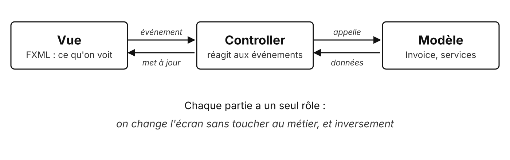
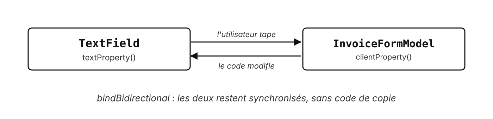
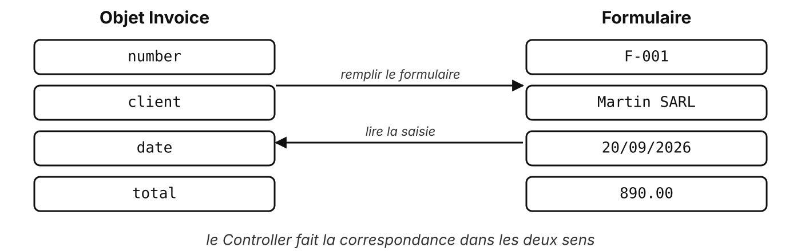
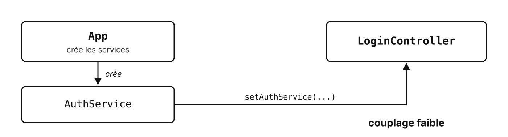

# Notions techniques

MVC, data binding, mapping, injection de dépendance

---

## MVC : Modèle, Vue, Controller



---

## MVC avec JavaFX

| Rôle | Dans l'application de facturation |
| --- | --- |
| **Vue** | `login.fxml`, `invoice-form.fxml` |
| **Controller** | `LoginController`, `InvoiceFormController` |
| **Modèle** | `Invoice`, `InvoiceFormModel`, `AuthService`, `InvoiceRepository` |

Le Controller ne contient **pas** de logique métier : il fait le lien

---

## Les Properties

Une valeur **observable** : on peut s'y abonner, s'y lier

```java
public class InvoiceFormModel {
    private final StringProperty client = new SimpleStringProperty("");

    public StringProperty clientProperty() {
        return client;
    }
}
```

Tous les composants JavaFX en ont : `textProperty()`, `disableProperty()`…

---

## Data binding



---

## Data binding en code

```java {1|3-5|all}
clientField.textProperty().bindBidirectional(model.clientProperty());

saveButton.disableProperty().bind(
        model.clientProperty().isEmpty().or(model.amountProperty().isEmpty())
);
```

- `bindBidirectional` : champ ⇄ modèle
- `bind` : le bouton se **désactive tout seul** tant que le formulaire est incomplet

---

## Mapping de données



---

## Mapping en code

```java {1-5|7-9}
Person person = new Person(
        nameField.getText(),
        firstNameField.getText(),
        Integer.parseInt(ageField.getText())
);

nameField.setText(person.getName());
firstNameField.setText(person.getFirstName());
ageField.setText(String.valueOf(person.getAge()));
```

Formulaire → objet (enregistrer), objet → formulaire (préremplir)

<!-- Différence avec le binding : copie ponctuelle, déclenchée par une action. -->

---

## Injection de dépendance

<v-switch>
  <template #0></template>
  <template #1></template>
</v-switch>

---

## Du couplage fort au couplage faible

<v-switch>
<template #0>

```java
public class LoginController {
    private AuthService authService = new AuthService();
}
```

Le Controller **fabrique** son service : impossible de le remplacer (test, autre implémentation)

</template>
<template #1>

```java
public class LoginController {
    private AuthService authService;

    public void setAuthService(AuthService authService) {
        this.authService = authService;
    }
}
```

Le service est **fourni de l'extérieur** : couplage faible

</template>
</v-switch>

---

## Avec JavaFX : injection par setter

```java {1-2|4-5}
FXMLLoader loader = new FXMLLoader(getClass().getResource("login.fxml"));
Parent root = loader.load();

LoginController controller = loader.getController();
controller.setAuthService(authService);
```

Le `FXMLLoader` crée le Controller lui-même (constructeur vide) : on injecte **juste après** le chargement

<!-- Un seul point d'assemblage : la classe `App` crée les services une fois. -->

---

## Inversion de contrôle

**Ce n'est plus mon code qui décide quand et quoi appeler**

| Qui fait quoi | Exemple |
| --- | --- |
| JavaFX appelle mes méthodes | `start(stage)`, `handleLogin()` |
| Le `FXMLLoader` crée mes objets | les composants et le Controller |
| On me fournit mes dépendances | `setAuthService(...)` : l'injection |

<!-- L'injection de dépendance est une forme d'inversion de contrôle. -->

---

## À retenir

- **MVC** : chaque partie a un seul rôle
- **Binding** : synchronisation automatique, **mapping** : copie ponctuelle
- **Couplage faible** : la dépendance est fournie, pas fabriquée
- **Un seul point d'assemblage** : la classe `App` crée les services une fois

---

## Pour aller plus loin

---

## Construire le Controller soi-même

```java
FXMLLoader loader = new FXMLLoader(getClass().getResource("login.fxml"));
loader.setControllerFactory(type -> new LoginController(authService));
Parent root = loader.load();
```

Injection **par constructeur** : le Controller ne peut pas exister sans son service

<!-- Non traité en TP : utile à connaître, pas nécessaire pour ce module. -->

---

## Des questions ?

---

## Sources

- [Documentation JavaFX 21](https://openjfx.io/javadoc/21/) : `javafx.beans.property`, `FXMLLoader`
- Martin Fowler, [Inversion of Control Containers and the Dependency Injection pattern](https://martinfowler.com/articles/injection.html)

