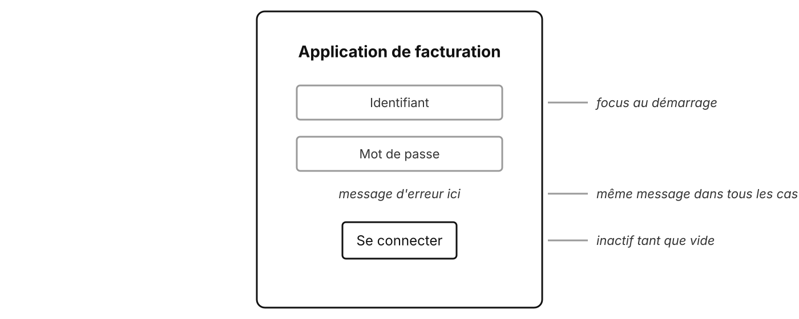
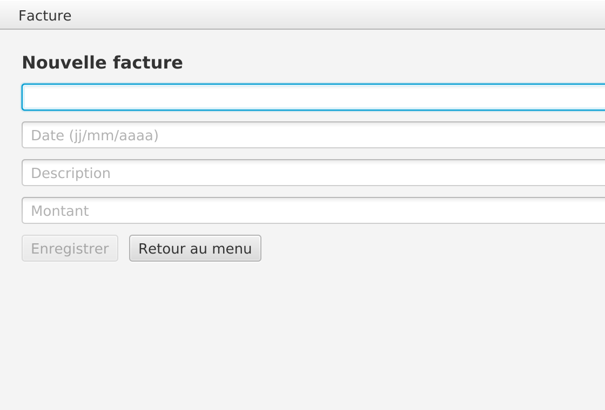
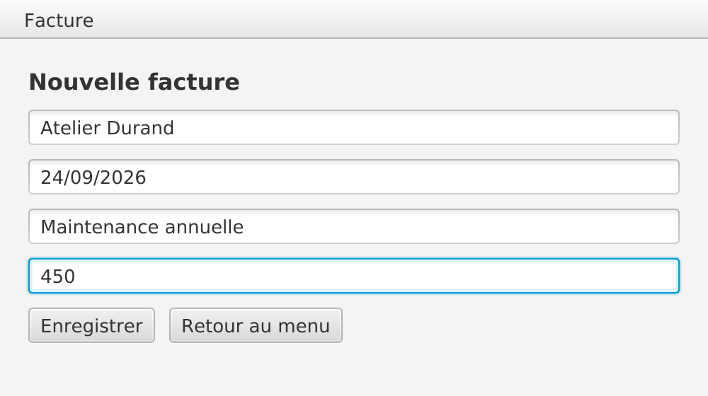
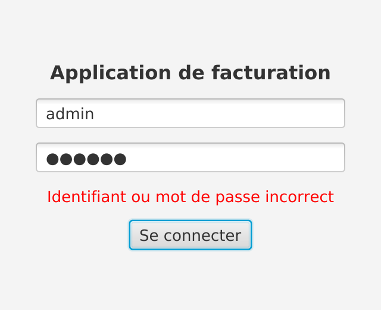

# RAD et UX

Concevoir vite, concevoir bien

---

## RAD : Rapid Application Development

- Une méthode formalisée par **James Martin** (1991)
- Des **prototypes** plutôt que de longues spécifications
- Des **itérations courtes**, l'utilisateur impliqué très tôt
- Des outils visuels pour construire vite : **Scene Builder**

---

## Du croquis à l'écran

| Étape | Outil | Coût d'un changement |
| --- | --- | --- |
| Croquis | papier, tableau blanc | nul |
| Maquette fil de fer | Figma, Excalidraw, Pencil | faible |
| Prototype | Scene Builder | moyen |
| Écran final | FXML + Controller | élevé |

Plus on change tôt, moins ça coûte

---

## Une maquette fil de fer

<!-- Pas de couleurs ni de détails : on discute de la structure et du comportement, pas du style. 

Autre nom : wireframe
-->

---

## UX et UI

| | UI (interface) | UX (expérience) |
| --- | --- | --- |
| Quoi | ce qu'on voit | ce qu'on vit |
| Question | est-ce clair et joli ? | est-ce utile et facile ? |
| Exemple | police, couleurs, alignements | nombre de clics, messages, erreurs évitées |

Une belle interface peut être pénible à utiliser

---

## Trois repères pour ce module

- **Cohérence** : mêmes libellés, mêmes emplacements, mêmes comportements
- **Retour utilisateur** : chaque action produit une réaction visible
- **Prévention des erreurs** : empêcher l'erreur plutôt que la signaler

Ils serviront à évaluer les écrans des TP suivants

---

## Prévenir les erreurs

<v-switch>
<template #0>

Formulaire incomplet : « Enregistrer » est inactif

</template>
<template #1>

Client et montant saisis : le bouton s'active

</template>
</v-switch>

<!-- Un binding sur `disableProperty` (TP 4) : pas une ligne de code de vérification au clic. -->

---

## Un message utile

Visible, près du champ, sans révéler si c'est l'identifiant ou le mot de passe

---

## La cohérence

- « Retour au menu » : **même libellé**, **même place** sur chaque écran
- La `MenuBar` **toujours visible** : on sait toujours où on est
- Mêmes formats partout : dates `jj/mm/aaaa`, montants `890.00 €`

---

## Pour aller plus loin

---

## Les heuristiques de Nielsen (1 à 5)

1. Visibilité de l'état du système
2. Correspondance avec le monde réel
3. Contrôle et liberté de l'utilisateur
4. Cohérence et standards
5. Prévention des erreurs

---

## Les heuristiques de Nielsen (6 à 10)

6. Reconnaître plutôt que se souvenir
7. Flexibilité et efficacité
8. Design esthétique et minimaliste
9. Aider à reconnaître et corriger les erreurs
10. Aide et documentation

---

## Des questions ?

---

## Sources

- James Martin, *Rapid Application Development*, Macmillan, 1991
- Jakob Nielsen, [10 Usability Heuristics for User Interface Design](https://www.nngroup.com/articles/ten-usability-heuristics/), Nielsen Norman Group
- Captures : corrigé du TP 9 du module
