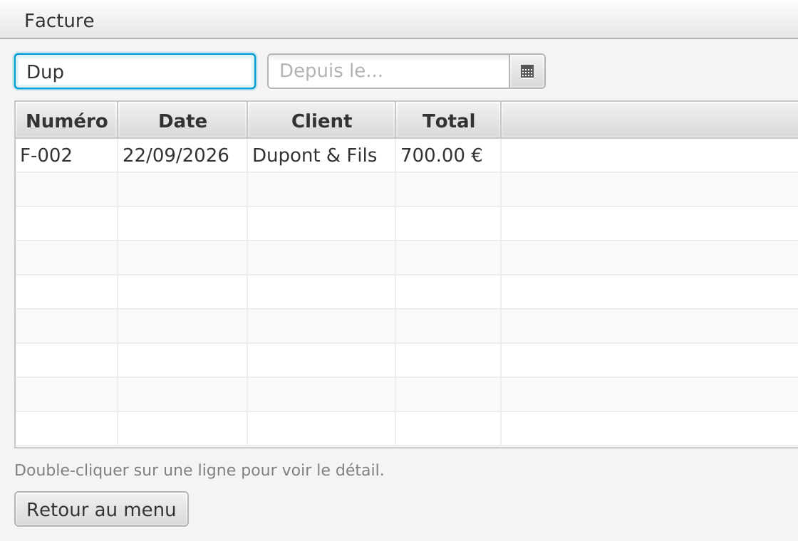
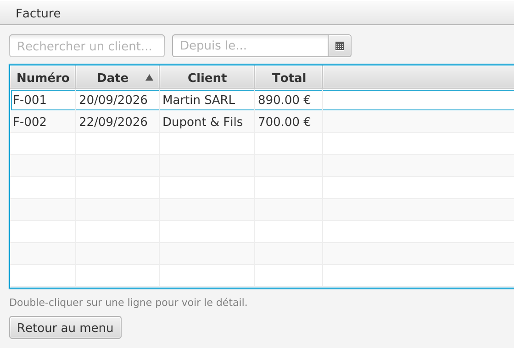
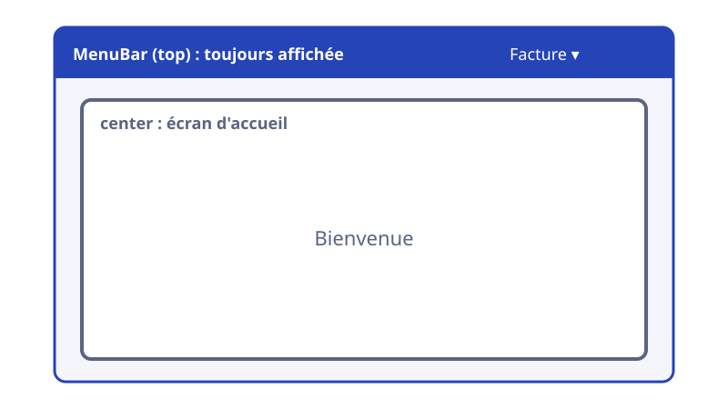
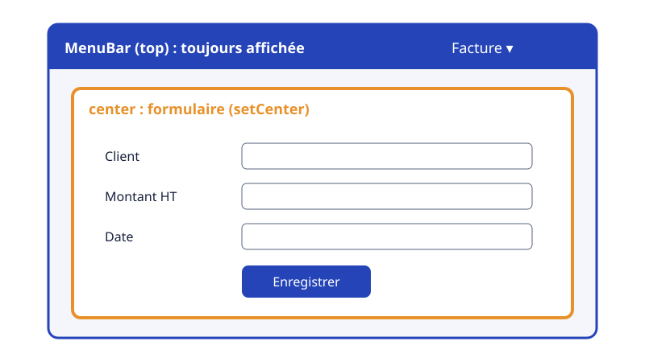
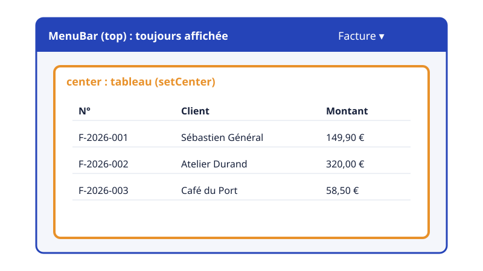

# Listes, filtres et navigation

Retrouver une facture, circuler entre les écrans

---

## Liste ou tableau ?

| | `ListView` | `TableView` |
| --- | --- | --- |
| Affiche | une colonne d'éléments | des colonnes typées |
| Exemple | des clients | des factures |
| Tri par colonne | non | oui |
| Source | `ObservableList` | `ObservableList` |

Même source, mêmes filtres : ce qui suit marche pour les deux

---

## Filtrer et trier


---

## En code

```java {1|2-3|4|all}
FilteredList<Invoice> filteredInvoices = new FilteredList<>(invoices, f -> true);
SortedList<Invoice> sortedInvoices = new SortedList<>(filteredInvoices);
sortedInvoices.comparatorProperty().bind(tableView.comparatorProperty());
tableView.setItems(sortedInvoices);
```

Le tri suit le **clic sur l'en-tête** des colonnes

<!-- On ne trie pas `FilteredList` directement : on l'enveloppe dans une `SortedList`. -->

---

## Le filtre : un prédicat

```java
searchField.textProperty().addListener((obs, old, value) -> applyFilter());

filteredInvoices.setPredicate(invoice ->
        invoice.getClient().toLowerCase().contains(search));
```

Recalculé **à chaque caractère** saisi

---

## Le résultat

<v-switch>
<template #0>

<p class="credit">Toutes les factures</p>
</template>
<template #1>

<p class="credit">« Dup » : seule la facture de Dupont & Fils reste</p>
</template>
<template #2>

<p class="credit">Clic sur « Date » : tri croissant (flèche dans l'en-tête)</p>
</template>
</v-switch>

---

## Naviguer entre les écrans

- **Remplacer le root** de la Scene : un aller simple
- Une **coquille** `BorderPane` : le menu reste, seul le centre change
- Toujours **la même fenêtre**

---

## Technique 1 : remplacer le root

```java
FXMLLoader loader = new FXMLLoader(getClass().getResource("shell.fxml"));
Parent root = loader.load();
scene.setRoot(root);
```

- Un écran = un FXML
- **Verrou d'accès** : la coquille ne se charge qu'après une connexion réussie

<!-- LoginController du TP 9 : aucun autre chemin ne mène à la coquille. -->

---

## Technique 2 : une coquille persistante

<v-switch>
  <template #0></template>
  <template #1></template>
  <template #2></template>
</v-switch>

<!-- La `MenuBar` ne bouge pas : seul le center change, via setCenter(...). -->

---

## Le menu


<p class="credit">MenuBar, Menu « Facture », deux MenuItem</p>

---

## Le menu en FXML

```xml
<BorderPane fx:controller="fr.cesi.invoicing.ShellController" fx:id="rootPane">
    <top>
        <MenuBar>
            <Menu text="Facture">
                <MenuItem text="Nouvelle facture" onAction="#handleNewInvoice" />
                <MenuItem text="Consulter les factures" onAction="#handleViewInvoices" />
            </Menu>
        </MenuBar>
    </top>
</BorderPane>
```

<!-- `shell.fxml` du TP 9, simplifié (sans `<menus>/<items>` ni le `Label` d'accueil). -->

---

## Changer le centre

```java
@FXML
private void handleViewInvoices() throws IOException {
    FXMLLoader loader = new FXMLLoader(getClass().getResource("invoice-table.fxml"));
    Parent table = loader.load();
    rootPane.setCenter(table);
}
```

| Moment | Technique |
| --- | --- |
| Connexion → coquille | `scene.setRoot(...)` |
| Dans la coquille | `borderPane.setCenter(...)` |

---

## De la liste au détail


<p class="credit">Double-clic sur une ligne : le détail s'affiche dans la coquille (setCenter)</p>

<!-- `tableView.setOnMouseClicked(...)` avec `event.getClickCount() == 2` ; la facture sélectionnée est transmise au Controller du détail. -->

---

## Pour aller plus loin

---

## Passer des données entre écrans

```java
FXMLLoader loader = new FXMLLoader(getClass().getResource("invoice-detail.fxml"));
Parent detail = loader.load();

InvoiceDetailController controller = loader.getController();
controller.setInvoice(invoice);

rootPane.setCenter(detail);
```

Même principe que l'injection : on **fournit** au Controller ce dont il a besoin

---

## Des questions ?

---

## Sources

- [Documentation JavaFX 21](https://openjfx.io/javadoc/21/) : `FilteredList`, `SortedList`, `ListView`, `MenuBar`, `BorderPane`

