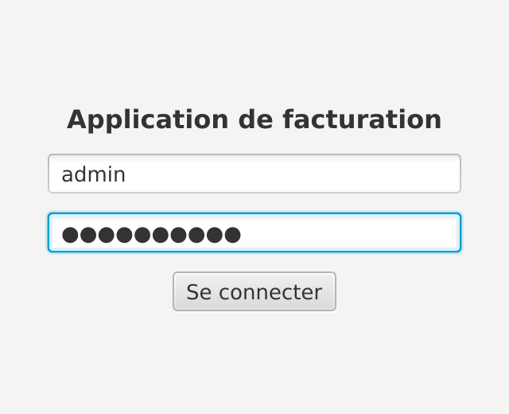
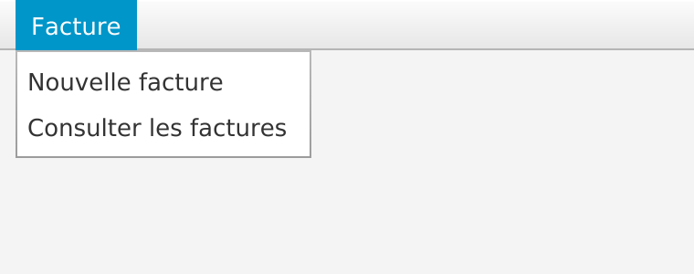
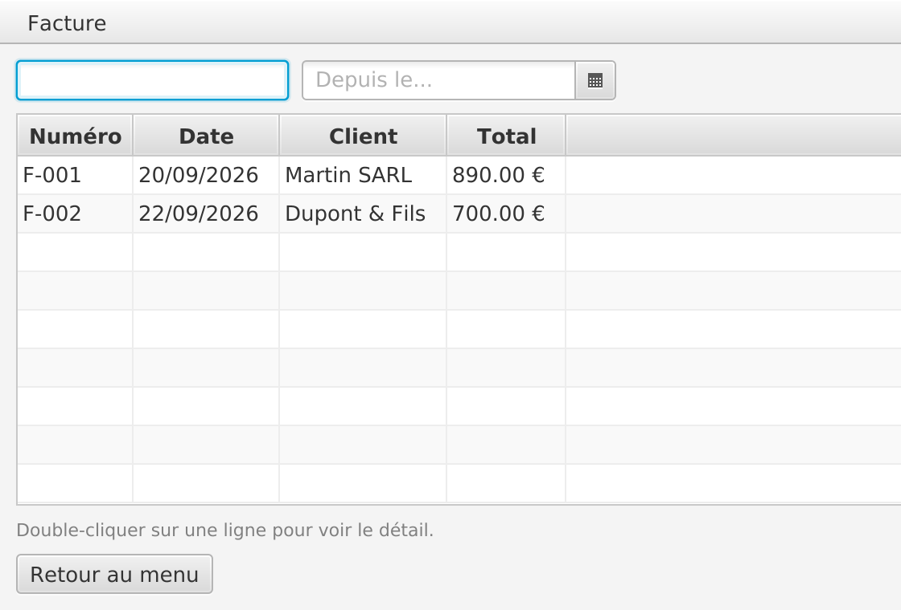
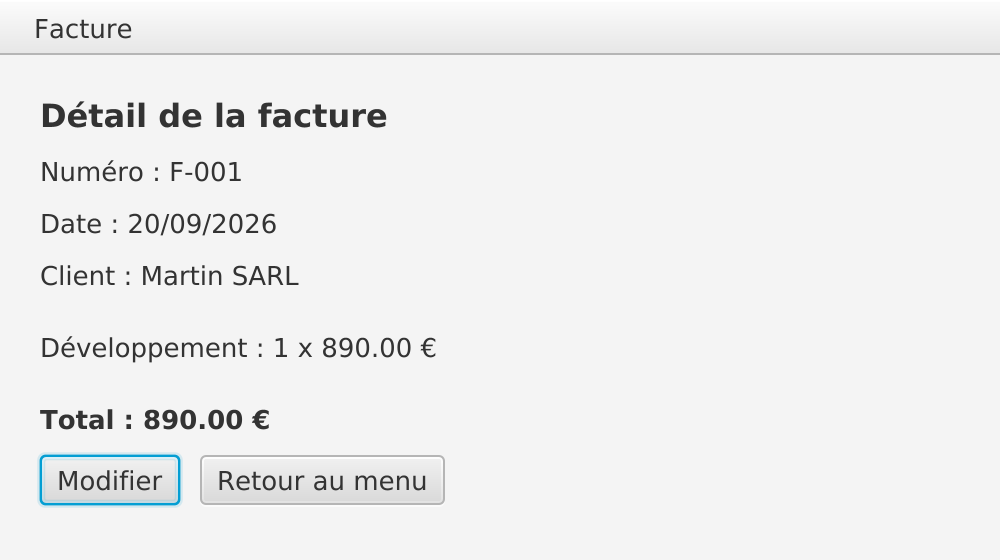

# Bilan du module

Trois jours, une application de facturation avec une vraie interface

---

## L'application de facturation

| Écran | Réalisé |
| --- | --- |
| Connexion | `AuthService` d'INFET10, verrou d'accès |
| Menu | coquille `BorderPane` et `MenuBar` |
| Saisie d'une facture | formulaire, data binding, validation |
| Liste des factures | `TableView`, recherche, filtre par date, tri |
| Détail | double-clic, retour au menu |

---

## Le parcours complet

<v-switch>
<template #0>
Connexion
</template>
<template #1>
Menu
</template>
<template #2>
Liste des factures
</template>
<template #3>
Détail d'une facture
</template>
</v-switch>

---

## Notions

| Thème | Notions |
| --- | --- |
| Client lourd | lourd vs léger, bibliothèques graphiques |
| JavaFX | Stage, Scene, Node, layouts, événements |
| Structure | FXML, Controller, MVC, Scene Builder |
| Données | Properties, binding, mapping, injection |
| Écrans | formulaire, TableView, filtres, navigation, menus |

<!-- Et les repères RAD / UX : cohérence, retour utilisateur, prévention des erreurs. -->

---

## Pour aller plus loin

---

## Des ressources à garder

| Ressource | Pour |
| --- | --- |
| [openjfx.io](https://openjfx.io/) | documentation et versions de JavaFX |
| [Scene Builder](https://gluonhq.com/products/scene-builder/) | l'éditeur visuel de FXML |
| [Nielsen Norman Group](https://www.nngroup.com/articles/ten-usability-heuristics/) | les heuristiques d'ergonomie |

---

## Des questions ?

---

## Sources

- Fiche module INFET9 (CESI)
- Les présentations du module ; captures : corrigé du TP 9
