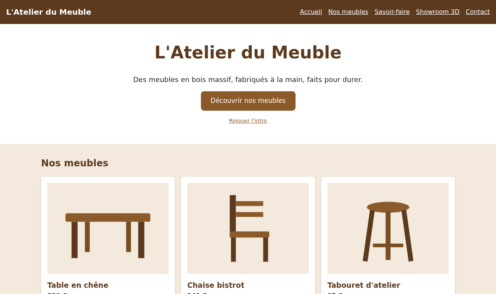

# INFET15 · Animation du site web en 2D/3D

Jours 3 et 4 : animer, jouer, passer en 3D

<!--
Les jours 1 et 2 (CSS avancé) ont eu lieu avec un autre formateur : ces deux jours commencent par des rappels.

Présenter le fil rouge et annoncer tout de suite le projet individuel.
-->

---

## Programme

- **Rappels** : animer et adapter une page en CSS, déclencher en JavaScript
- **GSAP** : animer une page avec une bibliothèque
- **Phaser** : un petit jeu 2D
- **Three.js** : une scène 3D dans la page
- **Projet individuel** : un jeu ou une animation, présenté à la fin

---

## Le fil rouge

Le site vitrine de **L'Atelier du Meuble**, TP après TP

---

## Jour 1

- Rappels CSS : transform, transition, keyframes
- Responsive et frameworks
- JavaScript : déclencher une animation
- GSAP
- Lancement du projet

---

## Jour 2

- Du DOM au canvas : Phaser
- Three.js : une scène 3D
- Projet, puis présentations
