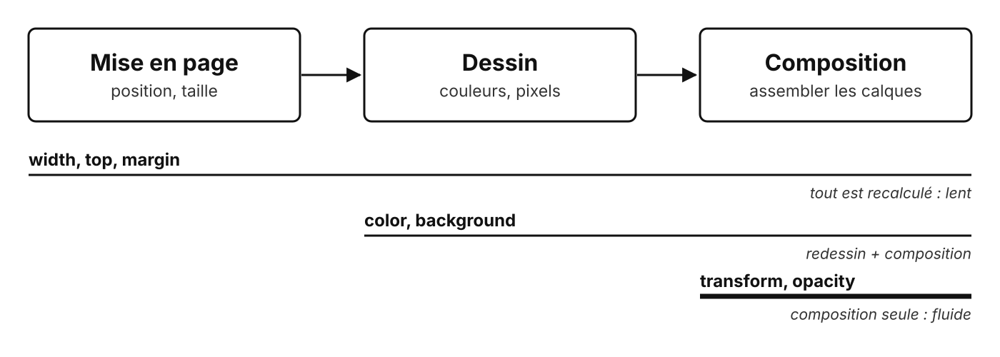

# Animer en CSS

Rappel des jours 1 et 2 : transformer, faire une transition, animer

<!--
Rappel, pas un cours complet : caler la durée sur les résultats du quiz diagnostic.

Toutes les animations de cette présentation sont du vrai CSS, qui tourne dans la slide.
-->

---

## Trois outils

| Outil | Rôle | Déclencheur |
| --- | --- | --- |
| **transform** | déplacer, agrandir, tourner, incliner | aucun : c'est un état |
| **transition** | passer d'un état à un autre en douceur | un changement : survol, classe |
| **@keyframes** | une animation en plusieurs étapes | aucun : elle se joue seule |

---

## Transformer

<div class="demo-row">
  <div class="demo-cell"><div class="demo-box anim-translate"></div><code>translate</code></div>
  <div class="demo-cell"><div class="demo-box anim-scale"></div><code>scale</code></div>
  <div class="demo-cell"><div class="demo-box anim-rotate"></div><code>rotate</code></div>
  <div class="demo-cell"><div class="demo-box anim-skew"></div><code>skew</code></div>
</div>

```css
.box-1 { transform: translateX(40px); }   /* déplacer */
.box-2 { transform: scale(1.4); }         /* agrandir */
.box-3 { transform: rotate(180deg); }     /* tourner */
.box-4 { transform: skew(25deg); }        /* incliner */
```

Les voisins ne bougent pas : **transform** ne change pas la mise en page

<style>
.demo-row { display: flex; justify-content: center; gap: 4rem; margin: 2rem 0; }
.demo-cell { display: flex; flex-direction: column; align-items: center; gap: 1.5rem; }
.demo-box { width: 70px; height: 70px; border-radius: 8px; background: currentColor; opacity: 0.8; }
.anim-translate { animation: t-translate 2s ease-in-out infinite alternate; }
.anim-scale { animation: t-scale 2s ease-in-out infinite alternate; }
.anim-rotate { animation: t-rotate 2s ease-in-out infinite alternate; }
.anim-skew { animation: t-skew 2s ease-in-out infinite alternate; }
@keyframes t-translate { to { transform: translateX(40px); } }
@keyframes t-scale { to { transform: scale(1.4); } }
@keyframes t-rotate { to { transform: rotate(180deg); } }
@keyframes t-skew { to { transform: skew(25deg); } }
</style>

<!--
Plusieurs fonctions à la suite : l'ordre compte (voir la démo).
-->

---

## Faire une transition

<div class="hover-zone">
  <div class="hover-box">survolez-moi</div>
</div>

```css
.card {
    transition: transform 0.3s ease;   /* sur l'état normal */
}

.card:hover {
    transform: translateY(-15px);      /* l'état d'arrivée */
}
```

Propriété, durée, easing, délai

<style>
.hover-zone { display: flex; justify-content: center; padding: 1.5rem 0 1rem; }
.hover-box { padding: 1rem 2rem; border: 3px solid currentColor; border-radius: 8px; transition: transform 0.3s ease; cursor: pointer; }
.hover-box:hover { transform: translateY(-15px); }
</style>

<!--
Piège classique : la transition déclarée sur :hover ne joue qu'à l'aller.

Faire survoler la boîte par un apprenant, si l'écran le permet.
-->

---

## L'easing : la sensation du mouvement

<div class="track">
  <div class="lane"><span>linear</span><div class="ball" style="animation-timing-function: linear"></div></div>
  <div class="lane"><span>ease</span><div class="ball" style="animation-timing-function: ease"></div></div>
  <div class="lane"><span>ease-in-out</span><div class="ball" style="animation-timing-function: ease-in-out"></div></div>
  <div class="lane"><span>cubic-bezier</span><div class="ball" style="animation-timing-function: cubic-bezier(0.68, -0.6, 0.32, 1.6)"></div></div>
</div>

Même durée, même distance : seule l'accélération change

<style>
.track { display: grid; gap: 0.8rem; width: 720px; margin: 2rem auto; }
.lane { display: grid; grid-template-columns: 11rem 1fr; white-space: nowrap; align-items: center; border-bottom: 1px dashed currentColor; padding-bottom: 0.4rem; }
.ball { margin-left: 4rem; width: 28px; height: 28px; border-radius: 50%; background: currentColor; animation: e-move 2s infinite alternate; }
@keyframes e-move { to { transform: translateX(420px); } }
</style>

---

## Animer avec @keyframes

<div class="kf-row">
  <div class="spinner"></div>
  <div class="bounce"></div>
</div>

```css
@keyframes bounce {
    0%, 100% { transform: translateY(0); }
    50%      { transform: translateY(-50px); }
}

.ball {
    animation: bounce 0.8s ease-in-out infinite;  /* nom, durée, easing, répétition */
}
```

<style>
.kf-row { display: flex; justify-content: center; gap: 6rem; align-items: flex-end; height: 110px; margin-bottom: 1rem; }
.spinner { width: 56px; height: 56px; border: 6px solid rgba(128,128,128,0.3); border-top-color: currentColor; border-radius: 50%; animation: kf-spin 1s linear infinite; }
.bounce { width: 40px; height: 40px; border-radius: 50%; background: currentColor; animation: kf-bounce 0.8s ease-in-out infinite; }
@keyframes kf-spin { to { transform: rotate(360deg); } }
@keyframes kf-bounce { 0%, 100% { transform: translateY(0); } 50% { transform: translateY(-50px); } }
</style>

<!--
Autres propriétés utiles : animation-delay, animation-direction (alternate), animation-fill-mode (both).

`both` sera utile au TP1 : garder l'état de départ pendant le délai.
-->

---

## Ce que le navigateur recalcule



Animer **transform** et **opacity** : fluide, même sur un vieux téléphone

<!--
Une animation, c'est 60 images par seconde : chaque image doit être calculée en moins de 16 ms.

Animer width ou top oblige à recalculer toute la mise en page à chaque image.
-->

---

## Respecter les utilisateurs

Certaines personnes sont gênées par le mouvement : vertiges, troubles de l'attention

```css
@media (prefers-reduced-motion: reduce) {
    *, *::before, *::after {
        animation: none !important;
        transition: none !important;
    }
}
```

Réglage du système, simulable dans le navigateur

<!--
Firefox : about:config, ui.prefersReducedMotion en type Nombre, valeur 1 (réduire), puis recharger la page ; supprimer la préférence ou valeur 0 pour revenir à la normale.
Chrome, Edge : Ctrl + Maj + P, puis « Emulate CSS prefers-reduced-motion ».

Fil conducteur des deux jours : une animation sert l'utilisateur, elle ne le gêne pas.
-->

---

## À retenir

- **transform** : un état, sans décaler les voisins
- **transition** : sur l'état normal, avec un déclencheur
- **@keyframes** : une animation qui se joue seule
- Animer **transform** et **opacity**
- **prefers-reduced-motion** : toujours

---

## Des questions ?

---

## Sources

- MDN : [transform](https://developer.mozilla.org/fr/docs/Web/CSS/transform), [transition](https://developer.mozilla.org/fr/docs/Web/CSS/transition), [animation](https://developer.mozilla.org/fr/docs/Web/CSS/animation), [prefers-reduced-motion](https://developer.mozilla.org/fr/docs/Web/CSS/@media/prefers-reduced-motion)
- web.dev : [animations performantes](https://web.dev/articles/animations-guide)
