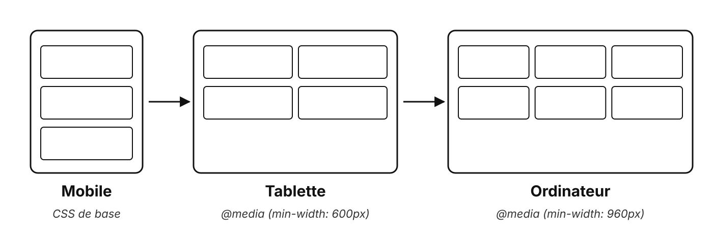
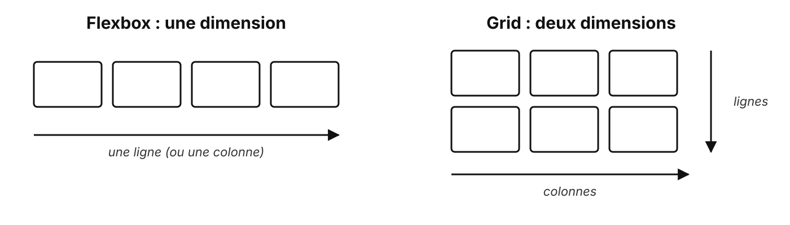

# Responsive et frameworks

Une page, tous les écrans

---

## Avant tout : le viewport

```html
<meta name="viewport" content="width=device-width, initial-scale=1">
```

Sans cette ligne, un téléphone affiche la page comme un écran d'ordinateur, en tout petit

---

## Mobile d'abord (mobile first)



```css
.grid { grid-template-columns: 1fr; }                /* le mobile, sans condition */

@media (min-width: 600px) {
    .grid { grid-template-columns: repeat(2, 1fr); } /* on ajoute pour les grands écrans */
}
```

<!--
Mobile first : le CSS de base vise le mobile, les media queries min-width ajoutent.

C'est exactement la structure du CSS fourni au TP1.
-->

---

## Flexbox ou grid ?



**Flexbox** : des éléments sur une ligne ou une colonne. **Grid** : des lignes et des colonnes à la fois

---

## Les frameworks CSS

| Framework | Principe | Exemple |
| --- | --- | --- |
| **Bootstrap** | des composants tout faits | `btn btn-primary` |
| **Tailwind** | des classes utilitaires | `p-4 rounded shadow` |
| **Animate.css** | des animations toutes faites | `animate__fadeInUp` |

Gain de temps, mais il faut comprendre le CSS en dessous pour l'adapter

<!--
Dans les TP, on écrit le CSS à la main : pour comprendre ce que le framework cache.
-->

---

## À retenir

- La balise **viewport**, toujours
- **Mobile first** : on part du petit écran, on ajoute
- **Flexbox** pour une dimension, **grid** pour deux
- Un framework s'utilise mieux quand on sait s'en passer

---

## Des questions ?

---

## Sources

- MDN : [media queries](https://developer.mozilla.org/fr/docs/Web/CSS/Guides/Media_queries/Using), [flexbox](https://developer.mozilla.org/fr/docs/Learn_web_development/Core/CSS_layout/Flexbox), [grid](https://developer.mozilla.org/fr/docs/Learn_web_development/Core/CSS_layout/Grids)
- [Bootstrap](https://getbootstrap.com/) · [Tailwind CSS](https://tailwindcss.com/) · [Animate.css](https://animate.style/)
