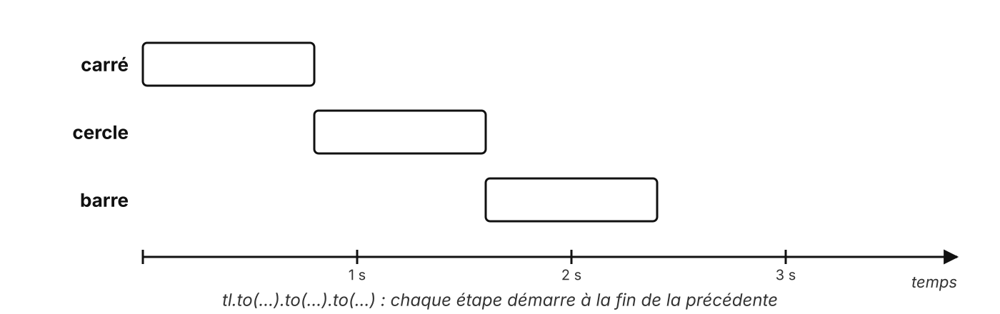
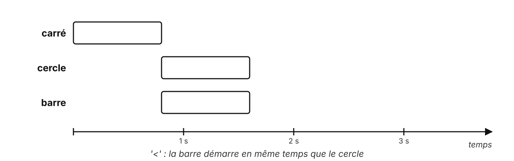
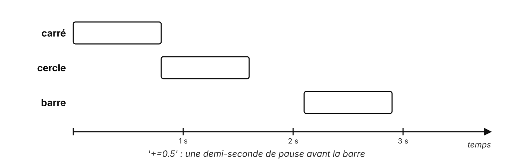

# GSAP

Animer une page avec une bibliothèque

---

## Le CSS seul, pour enchaîner trois animations

```css
.title    { animation: fade-in 0.6s ease-out both; }
.subtitle { animation: fade-in 0.6s ease-out 0.6s both; }   /* délai calculé à la main */
.button   { animation: fade-in 0.6s ease-out 1.2s both; }   /* et encore */
```

- Changer une durée : recalculer tous les délais
- Rejouer, mettre en pause, inverser : très compliqué

---

## La même chose avec GSAP

```js
const tl = gsap.timeline();

tl.from('.title', { opacity: 0, y: 30 })
  .from('.subtitle', { opacity: 0, y: 30 })
  .from('.button', { opacity: 0, y: 30 });
```

Chaque étape démarre à la fin de la précédente : **aucun délai à calculer**

<!--
GSAP : GreenSock Animation Platform, très utilisé en agence.

Chargé par CDN, avant notre script.
-->

---

## Trois méthodes

```js {1|2|3|all}
gsap.to('.logo', { rotation: 360 });                      // VERS cet état
gsap.from('.title', { y: -50, opacity: 0 });              // DEPUIS cet état, jusqu'au CSS
gsap.fromTo('.card', { scale: 0 }, { scale: 1 });         // DE... À...
```

Pour une arrivée sur la page : **from**

---

## La timeline, sur une ligne de temps

<v-switch>
  <template #0></template>
  <template #1></template>
  <template #2></template>
</v-switch>

<!--
- Clic 1 : par défaut, à la suite.
- Clic 2 : '<', en même temps que l'étape précédente.
- Clic 3 : '+=0.5', une pause avant.

Autre valeur utile au TP3 : '-=0.3', un léger chevauchement.
-->

---

## Décaler : stagger

<div class="dots">
  <span style="animation-delay: 0.00s"></span>
  <span style="animation-delay: 0.08s"></span>
  <span style="animation-delay: 0.16s"></span>
  <span style="animation-delay: 0.24s"></span>
  <span style="animation-delay: 0.32s"></span>
  <span style="animation-delay: 0.40s"></span>
  <span style="animation-delay: 0.48s"></span>
  <span style="animation-delay: 0.56s"></span>
  <span style="animation-delay: 0.64s"></span>
  <span style="animation-delay: 0.72s"></span>
  <span style="animation-delay: 0.80s"></span>
  <span style="animation-delay: 0.88s"></span>
</div>

```js
gsap.from('.item', { opacity: 0, y: 30, stagger: 0.1 });
```

Une ligne pour décaler chaque élément de la sélection

<style>
.dots { display: grid; grid-template-columns: repeat(12, 1fr); gap: 0.8rem; width: 640px; margin: 2.5rem auto; }
.dots span { aspect-ratio: 1; border-radius: 50%; background: currentColor; animation: st-drop 2.4s ease-out infinite; }
@keyframes st-drop { 0% { transform: translateY(-40px); opacity: 0; } 25%, 100% { transform: translateY(0); opacity: 1; } }
</style>

<!--
Ici, l'effet est reproduit en CSS pour la slide : en GSAP, c'est la ligne de code en dessous.
-->

---

## Piloter comme une vidéo

| Méthode | Effet |
| --- | --- |
| `tl.play()` / `tl.pause()` | lecture, pause |
| `tl.reverse()` | à l'envers |
| `tl.restart()` | depuis le début |
| `tl.progress(0.5)` | aller au milieu |

GSAP anime aussi des **objets JavaScript** : une caméra 3D, un score

---

## Qui l'utilise ?

- Des sites de marques qui racontent une histoire au défilement : voir la [vitrine GSAP](https://gsap.com/showcase/)
- **Gratuit**, y compris les plugins autrefois payants (ScrollTrigger, SplitText...), depuis son rachat par Webflow

<!--
Webflow a racheté GreenSock fin 2024 ; GSAP est devenu entièrement gratuit, usage commercial compris.

Ouvrir la vitrine en direct, 2 minutes maximum.
-->

---

## Respecter les utilisateurs

```js
const mm = gsap.matchMedia();

mm.add('(prefers-reduced-motion: no-preference)', () => {
    // l'intro n'est créée que si l'utilisateur accepte le mouvement
});
```

La règle CSS **prefers-reduced-motion** ne concerne pas GSAP

---

## À retenir

- **to**, **from**, **fromTo**
- Une **timeline** enchaîne sans délai à calculer
- **stagger** décale en une ligne
- On pilote : play, pause, reverse, progress
- Un élément = un seul outil pour l'animer (CSS **ou** GSAP)

---

## Des questions ?

---

## Sources

- [Documentation GSAP 3](https://gsap.com/docs/v3/) : [timeline](https://gsap.com/docs/v3/GSAP/Timeline/), [matchMedia](https://gsap.com/docs/v3/GSAP/gsap.matchMedia()/)
- Webflow, [GSAP becomes free](https://webflow.com/updates/gsap-becomes-free)
