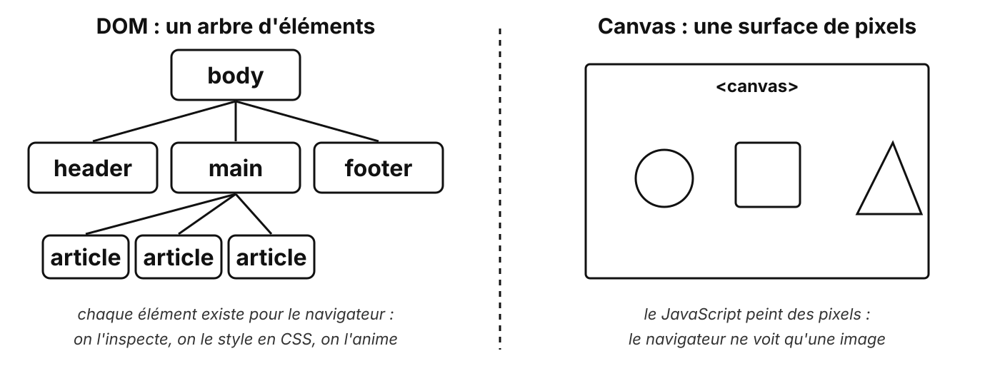
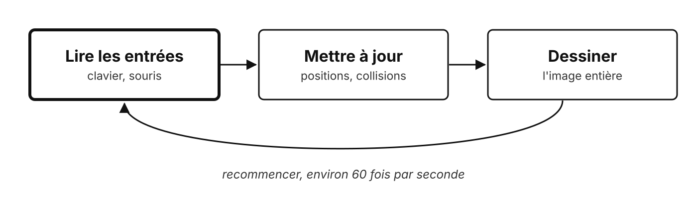
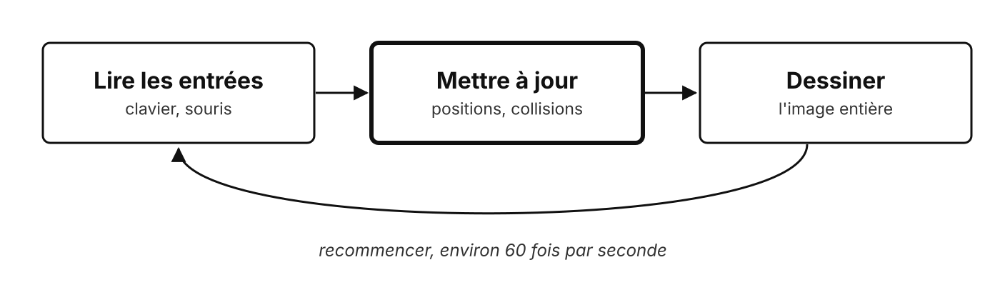
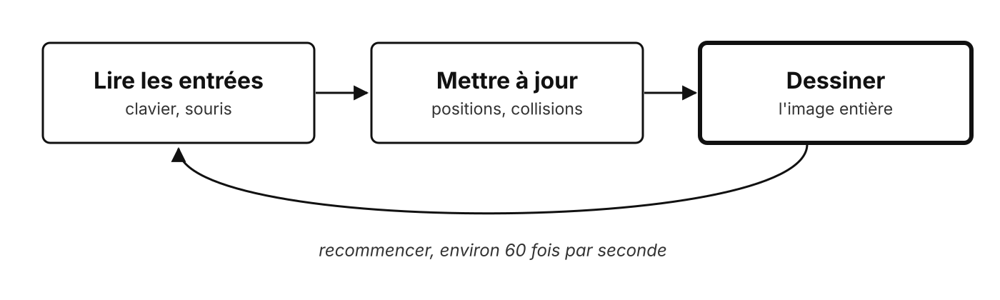
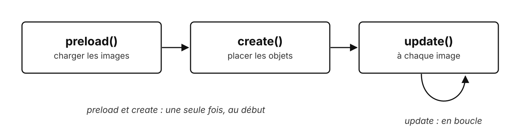
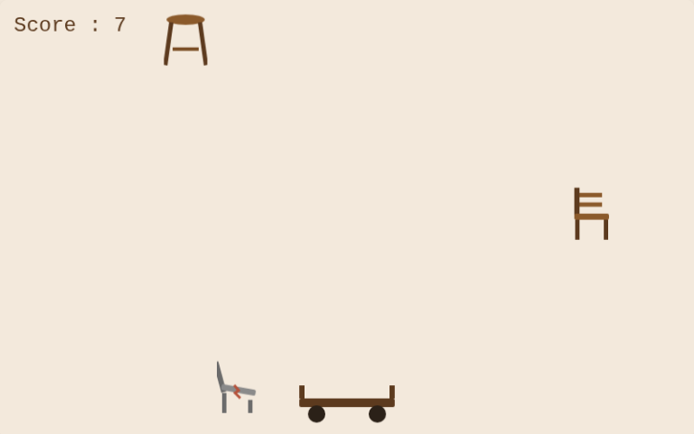

# Du DOM au canvas

Les moteurs de jeu, et Phaser

---

## Deux façons d'afficher



<!--
Test en direct, dans l'inspecteur (F12) :

- sur le site du TP3 : chaque carte, chaque bouton se sélectionne ;
- sur la page du jeu : un seul élément, le canvas. Le chariot n'existe pas pour le navigateur, ce ne sont que des pixels.
-->

---

## DOM ou canvas ?

| | DOM (CSS, GSAP) | Canvas (Phaser, Three.js) |
| --- | --- | --- |
| On anime | des éléments HTML | des pixels |
| Accessibilité | oui | à prévoir à part |
| 500 objets qui bougent | lent | fluide |
| Pour | un site | un jeu, de la 3D |

---

## La boucle de jeu

<v-switch>
  <template #0></template>
  <template #1></template>
  <template #2></template>
</v-switch>

<!--
- Clic 1 : quelles touches sont enfoncées ?
- Clic 2 : nouvelles positions, collisions, score.
- Clic 3 : on efface tout et on redessine tout.

Environ 60 fois par seconde : la démo montre cette boucle écrite à la main.
-->

---

## À la main : requestAnimationFrame

```js {1-5|7|all}
function loop() {
    update();                      // mettre à jour
    draw();                        // dessiner
    requestAnimationFrame(loop);   // recommencer à la prochaine image
}

requestAnimationFrame(loop);
```

Et tout le reste est à écrire : gravité, rebonds, collisions, chargement des images...

---

## Phaser : un moteur de jeu 2D

- La boucle, la **physique** (vitesse, gravité, collisions), le **clavier**, le chargement des **images**
- Gratuit, open source, chargé par CDN comme GSAP
- Un jeu = une ou plusieurs **Scenes**

---

## Une Scene : trois méthodes



---

## Une Scene en code

```js {1|2-4|5-8|9-17|all}
class GameScene extends Phaser.Scene {
    preload() {
        this.load.image('cart', 'images/game/cart.svg');      // charger l'image, sous la clé 'cart'
    }
    create() {
        this.cart = this.physics.add.image(400, 460, 'cart');  // placer le chariot en x = 400, y = 460
        this.cursors = this.input.keyboard.createCursorKeys(); // récupérer les flèches du clavier
    }
    update() {
        if (this.cursors.left.isDown) {
            this.cart.setVelocityX(-400);                      // flèche gauche : vers la gauche
        } else if (this.cursors.right.isDown) {
            this.cart.setVelocityX(400);                       // flèche droite : vers la droite
        } else {
            this.cart.setVelocityX(0);                         // aucune flèche : on s'arrête
        }
    }
}
```

<!--
- Clic 1 : une Scene est une classe, qui hérite de Phaser.Scene.
- Clic 2 : preload, une fois, avant tout.
- Clic 3 : create, une fois : placer les objets.
- Clic 4 : update, 60 fois par seconde : on teste les touches, on donne une vitesse ; la physique déplace le chariot.

Tout passe par this : la scène.

C'est volontairement l'étape 1 du TP4 : elle est guidée, les étapes 2 et 3 restent à chercher.
-->

---

## Ce que ça donne



**preload** a chargé les images, **create** a placé le chariot et le score, **update** le déplace à chaque image

---

## Un vrai succès, né avec Phaser

**Vampire Survivors** : d'abord développé en JavaScript avec Phaser, puis porté sur Unity en 2023 pour les consoles

<!--
Un jeu indépendant vendu à des millions d'exemplaires, qui a démarré avec l'outil du TP4.

Le passage à Unity : JavaScript tourne mal sur les consoles.
-->

---

## Le TP4 : attrapez les meubles

- Fourni : la page, les images, `preload`, le chariot et le score
- À écrire : le clavier, la chute des meubles, la collision et le score

---

## À retenir

- **Canvas** : des pixels redessinés à chaque image
- La **boucle** : lire, mettre à jour, dessiner
- **Phaser** fournit la boucle, la physique, les entrées
- Une Scene : **preload**, **create**, **update**

---

## Des questions ?

---

## Sources

- [Documentation Phaser](https://docs.phaser.io/) · [exemples](https://phaser.io/examples)
- MDN : [requestAnimationFrame](https://developer.mozilla.org/fr/docs/Web/API/Window/requestAnimationFrame)
- Phaser, [Dev Report, juillet 2023](https://phaser.io/devlogs/279) · Wikipédia, [Vampire Survivors](https://en.wikipedia.org/wiki/Vampire_Survivors)
