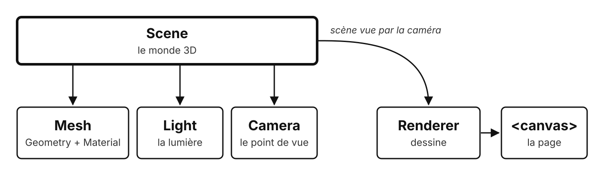
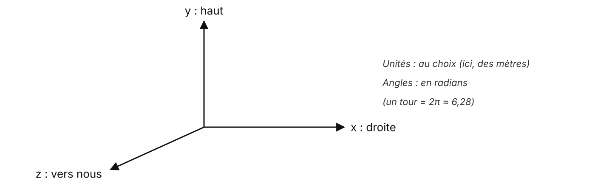
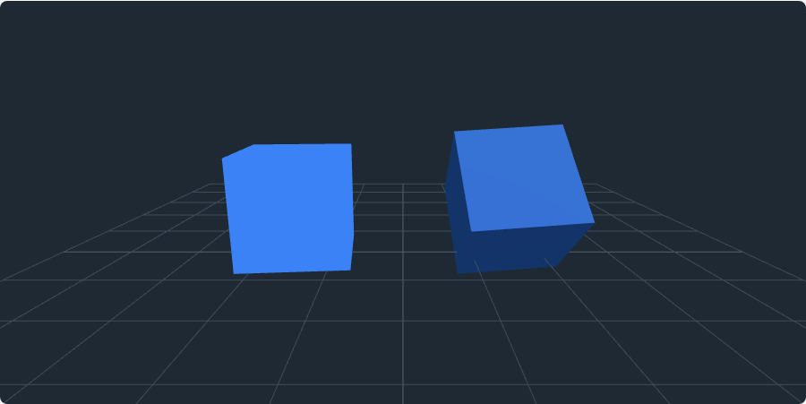
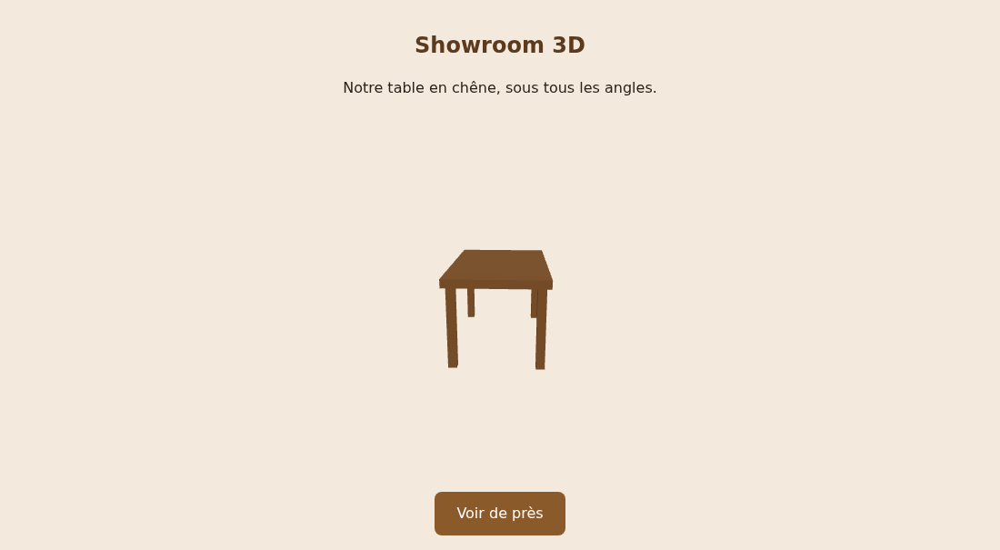

# Three.js

Une scène 3D dans la page

---

## Les briques d'une scène



<!--
Comme au cinéma : un décor (la scène), des objets, des projecteurs, une caméra.

Le renderer « filme » et affiche dans un canvas.
-->

---

## Se repérer en 3D



---

## 1. La scène, la caméra, le renderer

```js
const scene = new THREE.Scene();                   // le monde, vide pour l'instant

const camera = new THREE.PerspectiveCamera(
    50,              // angle de vue, en degrés
    width / height,  // proportions de l'image
    0.1,             // distance minimale de vision
    100              // distance maximale de vision
);
camera.position.set(0, 2, 5);                      // x, y, z : un peu en hauteur, en recul

const renderer = new THREE.WebGLRenderer();        // le « caméraman »
renderer.setSize(width, height);
container.appendChild(renderer.domElement);        // son canvas, ajouté dans la page
```

---

## 2. Un objet : une forme et une matière

```js
const geometry = new THREE.BoxGeometry(1, 1, 1);                       // largeur, hauteur, profondeur
const material = new THREE.MeshStandardMaterial({ color: 0x8b5a2b });  // couleur, en hexadécimal

const box = new THREE.Mesh(geometry, material);                        // forme + matière
box.position.y = 0.5;                                                  // position de son CENTRE
scene.add(box);                                                        // sans add, il n'existe pas
```

Une même forme ou une même matière peut servir à plusieurs objets

---

## 3. La lumière

```js
scene.add(new THREE.AmbientLight(0xffffff, 1));       // partout, un peu : rien n'est noir

const sun = new THREE.DirectionalLight(0xffffff, 2);  // d'une direction, comme le soleil
sun.position.set(3, 5, 4);                            // d'où elle vient
scene.add(sun);
```

La lumière directionnelle crée des faces claires et sombres : c'est elle qui donne le relief

---

## 4. La boucle de rendu

```js
renderer.setAnimationLoop(() => {       // avant chaque image, environ 60 fois par seconde
    box.rotation.y += 0.01;             // mettre à jour : un peu de rotation (en radians)
    renderer.render(scene, camera);     // dessiner : la scène, vue par la caméra
});
```

La même boucle qu'un jeu : mettre à jour, puis dessiner

<!--
Faire le lien avec la présentation précédente : lire les entrées, mettre à jour, dessiner.
-->

---

## Le code minimal, en entier

```js {1|3-5|7-11|13|15-18|all}
import * as THREE from 'three';

const scene = new THREE.Scene();
const camera = new THREE.PerspectiveCamera(50, width / height, 0.1, 100);
const renderer = new THREE.WebGLRenderer();

const box = new THREE.Mesh(
    new THREE.BoxGeometry(1, 1, 1),                         // la forme
    new THREE.MeshStandardMaterial({ color: 0x8b5a2b })     // la matière
);
scene.add(box);

scene.add(new THREE.DirectionalLight(0xffffff, 2));

renderer.setAnimationLoop(() => {                            // avant chaque image
    box.rotation.y += 0.01;
    renderer.render(scene, camera);
});
```

<!--
Chargé en module ES par une import map : d'où Live Server au TP5.
-->

---

## Basic ou Standard ?



À gauche **MeshBasicMaterial** : ignore la lumière. À droite **MeshStandardMaterial** : sans lumière, il est **noir**

---

## GSAP anime aussi la 3D

```js
gsap.to(camera.position, { z: 2, duration: 1.5 });
```

Une position 3D est un objet JavaScript : GSAP l'anime comme le reste

---

## Jusqu'où ça va ?

Le portfolio de **Bruno Simon** : on conduit une petite voiture entre ses projets, en Three.js

[bruno-simon.com](https://bruno-simon.com/)

<!--
Ouvrir le site en direct : effet garanti.

Un portfolio devenu viral, qui a lancé la carrière de son auteur ; il enseigne aujourd'hui Three.js.
-->

---

## Le TP5 : le showroom 3D



---

## À retenir

- Scène, objets, lumières, caméra, **renderer**
- Un objet = une **forme** + une **matière**
- Sans lumière, **Standard** reste noir
- La boucle de rendu : on y déplace, on n'y crée rien
- GSAP anime aussi la 3D

---

## Des questions ?

---

## Sources

- [Documentation Three.js](https://threejs.org/docs/) · [créer une scène](https://threejs.org/manual/#en/creating-a-scene) · [exemples](https://threejs.org/examples/)
- [Portfolio de Bruno Simon](https://bruno-simon.com/) · [Three.js Journey](https://threejs-journey.com/)
